<!-- GENERATED:MODEL -->
---
tags: [odoo, enterprise, generated, model]
---

# room.booking

- Module: [[docs/Enterprise Addons/room/room|room]]
- Scope: Enterprise Addons
- Defined in module: yes
- Source files: `models/room_booking.py`
- Python classes: `RoomBooking`
- Description: Room Booking
- Inherits: `mail.thread`

## Field footprint

- Detected fields: 7
- Field types: `Char` x 1, `Datetime` x 2, `Many2one` x 4
- Relation fields: 4

## Sample fields

- `company_id`: `Many2one` (related `room_id.company_id`, store `True`)
- `name`: `Char`
- `office_id`: `Many2one` (related `room_id.office_id`, store `True`)
- `organizer_id`: `Many2one` (comodel `res.users`)
- `room_id`: `Many2one` (comodel `room.room`)
- `start_datetime`: `Datetime`
- `stop_datetime`: `Datetime`

## Method hints

- Detected methods: 7
- Action methods: none
- Compute methods: none
- Onchange methods: none

## Direct relation diagram

```plantuml
@startuml
!define ODOO_COLOR_PRIMARY #714B67
!define ODOO_COLOR_ACCENT #875A7B
!define ODOO_COLOR_BG #FAF7FA

skinparam backgroundColor ODOO_COLOR_BG
skinparam defaultTextAlignment left
skinparam ArrowColor ODOO_COLOR_ACCENT
skinparam ClassBackgroundColor white
skinparam ClassBorderColor ODOO_COLOR_PRIMARY
skinparam ComponentBackgroundColor white
skinparam ComponentBorderColor ODOO_COLOR_PRIMARY
skinparam NoteBackgroundColor #FFF8FF
skinparam NoteBorderColor ODOO_COLOR_ACCENT
skinparam SequenceLifeLineBorderColor ODOO_COLOR_ACCENT
skinparam SequenceLifeLineBackgroundColor #FFFFFF
skinparam SequenceParticipantBorderColor ODOO_COLOR_PRIMARY
skinparam SequenceParticipantBackgroundColor #FFFFFF
skinparam sequence {
  ArrowColor ODOO_COLOR_ACCENT
  ActorBorderColor ODOO_COLOR_PRIMARY
}
title room.booking - Direct Relations
class "room.booking" as room_booking
class "res.users" as res_users
class "room.room" as room_room
room_booking --> room_room : room_id
room_booking --> res_users : organizer_id
@enduml
```

## Navigation

- **Parent:** [[docs/Enterprise Addons/room/Models]]

<!-- GENERATED:MODEL -->
