<!-- GENERATED:MODEL -->
---
tags: [odoo, enterprise, generated, model]
---

# room.room

- Module: [[docs/Enterprise Addons/room/room|room]]
- Scope: Enterprise Addons
- Defined in module: yes
- Source files: `models/room_room.py`
- Python classes: `RoomRoom`
- Description: Room
- Inherits: `mail.thread`

## Field footprint

- Detected fields: 15
- Field types: `Boolean` x 2, `Char` x 6, `Datetime` x 1, `Html` x 1, `Image` x 1, `Many2one` x 2, `One2many` x 1, `Properties` x 1
- Relation fields: 3

## Sample fields

- `access_token`: `Char` (comodel `Access Token`)
- `active`: `Boolean` (comodel `Active`)
- `bookable_background_color`: `Char` (comodel `Available Background Color`)
- `booked_background_color`: `Char` (comodel `Booked Background Color`)
- `company_id`: `Many2one` (related `office_id.company_id`, store `True`)
- `description`: `Html`
- `is_available`: `Boolean` (compute `_compute_is_available`)
- `name`: `Char`
- `next_booking_start`: `Datetime` (comodel `Next Booking Start`, compute `_compute_next_booking_start`)
- `office_id`: `Many2one` (comodel `room.office`)
- `room_background_image`: `Image` (comodel `Background Image`)
- `room_booking_ids`: `One2many` (comodel `room.booking`)
- `room_booking_url`: `Char` (comodel `Room Link`, compute `_compute_room_booking_url`)
- `room_properties`: `Properties` (comodel `Properties`)
- `short_code`: `Char` (comodel `Short Code`)

## Method hints

- Detected methods: 8
- Action methods: `action_open_booking_view`, `action_view_bookings`
- Compute methods: `_compute_display_name`, `_compute_is_available`, `_compute_next_booking_start`, `_compute_room_booking_url`
- Onchange methods: none

## Direct relation diagram

```plantuml
@startuml
!define ODOO_COLOR_PRIMARY #714B67
!define ODOO_COLOR_ACCENT #875A7B
!define ODOO_COLOR_BG #FAF7FA

skinparam backgroundColor ODOO_COLOR_BG
skinparam defaultTextAlignment left
skinparam ArrowColor ODOO_COLOR_ACCENT
skinparam ClassBackgroundColor white
skinparam ClassBorderColor ODOO_COLOR_PRIMARY
skinparam ComponentBackgroundColor white
skinparam ComponentBorderColor ODOO_COLOR_PRIMARY
skinparam NoteBackgroundColor #FFF8FF
skinparam NoteBorderColor ODOO_COLOR_ACCENT
skinparam SequenceLifeLineBorderColor ODOO_COLOR_ACCENT
skinparam SequenceLifeLineBackgroundColor #FFFFFF
skinparam SequenceParticipantBorderColor ODOO_COLOR_PRIMARY
skinparam SequenceParticipantBackgroundColor #FFFFFF
skinparam sequence {
  ArrowColor ODOO_COLOR_ACCENT
  ActorBorderColor ODOO_COLOR_PRIMARY
}
title room.room - Direct Relations
class "room.room" as room_room
class "room.booking" as room_booking
class "room.office" as room_office
room_room --> room_office : office_id
room_room --|> room_booking : room_booking_ids
@enduml
```

## Navigation

- **Parent:** [[docs/Enterprise Addons/room/Models]]

<!-- GENERATED:MODEL -->
