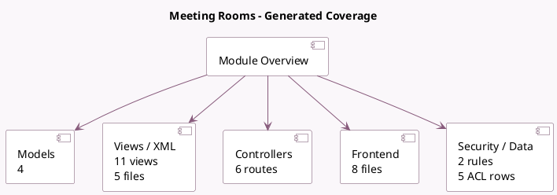

<!-- GENERATED:MODULE -->
---
tags: [odoo, enterprise, module]
---

# Meeting Rooms

- Scope: Enterprise Addons
- Source: enterprise/room
- Dependencies: [[docs/Community Addons/mail/mail|mail]], [[docs/Enterprise Addons/web_gantt/web_gantt|web_gantt]]

## Summary

Manage Meeting Rooms

## Generated coverage

- Models: 4
- XML files with UI/data artifacts: 5
- Views: 11
- Actions: 2
- Menus: 3
- Rules (ir.rule): 2
- Access CSV entries: 5
- Controller units: 1
- Frontend asset files: 8

## Module map

## Detail notes

- Models: [[docs/Enterprise Addons/room/Models|Models]] (4)
- Views and XML: [[docs/Enterprise Addons/room/Views|Views]] (5 files)
- Controllers: [[docs/Enterprise Addons/room/Controllers|Controllers]] (1)
- Frontend: [[docs/Enterprise Addons/room/Frontend|Frontend]] (8 files)

## Key models

- `ir.http`
- `room.booking`
- `room.office`
- `room.room`

## Navigation

- [[../Enterprise Addons/Enterprise Addons|Back to scope]]
- [[../../docs/docs|Back to docs]]

<!-- GENERATED:MODULE -->

