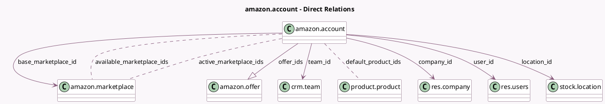

<!-- GENERATED:MODEL -->
---
tags: [odoo, enterprise, generated, model]
---

# amazon.account

- Module: [[docs/Enterprise Addons/sale_amazon/sale_amazon|sale_amazon]]
- Scope: Enterprise Addons
- Defined in module: yes
- Source files: `models/amazon_account.py`
- Python classes: `AmazonAccount`
- Description: Amazon Account

## Field footprint

- Detected fields: 22
- Field types: `Boolean` x 2, `Char` x 5, `Datetime` x 3, `Integer` x 2, `Many2many` x 3, `Many2one` x 5, `One2many` x 1, `Selection` x 1
- Relation fields: 9

## Sample fields

- `access_token`: `Char` (store `False`)
- `access_token_expiry`: `Datetime` (store `False`)
- `active`: `Boolean`
- `active_marketplace_ids`: `Many2many` (comodel `amazon.marketplace`)
- `available_marketplace_ids`: `Many2many` (comodel `amazon.marketplace`)
- `base_marketplace_id`: `Many2one` (comodel `amazon.marketplace`)
- `company_id`: `Many2one` (comodel `res.company`)
- `default_product_ids`: `Many2many` (comodel `product.product`, compute `_compute_default_product_ids`)
- `last_orders_sync`: `Datetime`
- `location_id`: `Many2one` (comodel `stock.location`)
- `name`: `Char` (compute `_compute_name`, store `True`)
- `offer_count`: `Integer` (compute `_compute_offer_count`)
- `offer_ids`: `One2many` (comodel `amazon.offer`)
- `order_count`: `Integer` (compute `_compute_order_count`)
- `refresh_token`: `Char`
- `restricted_data_token`: `Char` (store `False`)
- `restricted_data_token_expiry`: `Datetime` (store `False`)
- `seller_key`: `Char`
- `state`: `Selection` (compute `_compute_state`)
- `synchronize_inventory`: `Boolean`

## Method hints

- Detected methods: 38
- Action methods: `action_archive`, `action_recover_order`, `action_redirect_to_oauth_url`, `action_reset_refresh_token`, `action_sync_feeds_status`, `action_sync_inventory`, `action_sync_orders`, `action_sync_pickings`, and 3 more
- Compute methods: `_compute_default_product_ids`, `_compute_name`, `_compute_offer_count`, `_compute_order_count`, `_compute_state`
- Onchange methods: `_onchange_last_orders_sync`

## Direct relation diagram

## Navigation

- **Parent:** [[docs/Enterprise Addons/sale_amazon/Models]]

<!-- GENERATED:MODEL -->
