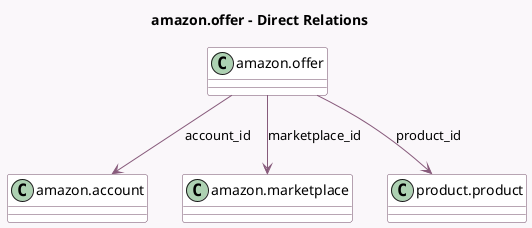

<!-- GENERATED:MODEL -->
---
tags: [odoo, enterprise, generated, model]
---

# amazon.offer

- Module: [[docs/Enterprise Addons/sale_amazon/sale_amazon|sale_amazon]]
- Scope: Enterprise Addons
- Defined in module: yes
- Source files: `models/amazon_offer.py`
- Python classes: `AmazonOffer`
- Description: Amazon Offer

## Field footprint

- Detected fields: 11
- Field types: `Boolean` x 1, `Char` x 2, `Many2many` x 1, `Many2one` x 5, `Selection` x 2
- Relation fields: 6

## Sample fields

- `account_id`: `Many2one` (comodel `amazon.account`)
- `active_marketplace_ids`: `Many2many` (related `account_id.active_marketplace_ids`)
- `amazon_channel`: `Selection`
- `amazon_feed_ref`: `Char`
- `amazon_sync_status`: `Selection`
- `company_id`: `Many2one` (related `account_id.company_id`)
- `marketplace_id`: `Many2one` (comodel `amazon.marketplace`)
- `product_id`: `Many2one` (comodel `product.product`)
- `product_template_id`: `Many2one` (related `product_id.product_tmpl_id`, store `True`)
- `sku`: `Char`
- `sync_stock`: `Boolean` (compute `_compute_sync_stock`, store `True`)

## Method hints

- Detected methods: 12
- Action methods: `action_view_online`
- Compute methods: `_compute_sync_stock`
- Onchange methods: `_onchange_product_id`

## Direct relation diagram

## Navigation

- **Parent:** [[docs/Enterprise Addons/sale_amazon/Models]]

<!-- GENERATED:MODEL -->
