<!-- GENERATED:MODEL -->
---
tags: [odoo, enterprise, generated, model]
---

# crm.team

- Module: [[docs/Enterprise Addons/sale_commission/sale_commission|sale_commission]]
- Scope: Enterprise Addons
- Defined in module: extension only
- Source files: `model/crm_team.py`
- Python classes: `CrmTeam`

## Field footprint

- Detected fields: 1
- Field types: `Many2many` x 1
- Relation fields: 1

## Sample fields

- `commission_plan_ids`: `Many2many` (comodel `sale.commission.plan`)

## Method hints

- Detected methods: 0
- Action methods: none
- Compute methods: none
- Onchange methods: none

## Direct relation diagram

```plantuml
@startuml
!define ODOO_COLOR_PRIMARY #714B67
!define ODOO_COLOR_ACCENT #875A7B
!define ODOO_COLOR_BG #FAF7FA

skinparam backgroundColor ODOO_COLOR_BG
skinparam defaultTextAlignment left
skinparam ArrowColor ODOO_COLOR_ACCENT
skinparam ClassBackgroundColor white
skinparam ClassBorderColor ODOO_COLOR_PRIMARY
skinparam ComponentBackgroundColor white
skinparam ComponentBorderColor ODOO_COLOR_PRIMARY
skinparam NoteBackgroundColor #FFF8FF
skinparam NoteBorderColor ODOO_COLOR_ACCENT
skinparam SequenceLifeLineBorderColor ODOO_COLOR_ACCENT
skinparam SequenceLifeLineBackgroundColor #FFFFFF
skinparam SequenceParticipantBorderColor ODOO_COLOR_PRIMARY
skinparam SequenceParticipantBackgroundColor #FFFFFF
skinparam sequence {
  ArrowColor ODOO_COLOR_ACCENT
  ActorBorderColor ODOO_COLOR_PRIMARY
}
title crm.team - Direct Relations
class "crm.team" as crm_team
class "sale.commission.plan" as sale_commission_plan
crm_team .. sale_commission_plan : commission_plan_ids
@enduml
```

## Navigation

- **Parent:** [[docs/Enterprise Addons/sale_commission/Models]]

<!-- GENERATED:MODEL -->
