<!-- GENERATED:MODEL -->
---
tags: [odoo, enterprise, generated, model]
---

# res.users

- Module: [[docs/Enterprise Addons/sale_commission/sale_commission|sale_commission]]
- Scope: Enterprise Addons
- Defined in module: extension only
- Source files: `model/res_users.py`
- Python classes: `ResUsers`

## Field footprint

- Detected fields: 2
- Field types: `One2many` x 2
- Relation fields: 2

## Sample fields

- `commission_plan_users_ids`: `One2many` (comodel `sale.commission.plan.user`)
- `filtered_commission_plan_users_ids`: `One2many` (comodel `sale.commission.plan.user`, compute `_compute_filtered_commission_plan_users_ids`)

## Method hints

- Detected methods: 2
- Action methods: none
- Compute methods: `_compute_filtered_commission_plan_users_ids`
- Onchange methods: none

## Direct relation diagram

```plantuml
@startuml
!define ODOO_COLOR_PRIMARY #714B67
!define ODOO_COLOR_ACCENT #875A7B
!define ODOO_COLOR_BG #FAF7FA

skinparam backgroundColor ODOO_COLOR_BG
skinparam defaultTextAlignment left
skinparam ArrowColor ODOO_COLOR_ACCENT
skinparam ClassBackgroundColor white
skinparam ClassBorderColor ODOO_COLOR_PRIMARY
skinparam ComponentBackgroundColor white
skinparam ComponentBorderColor ODOO_COLOR_PRIMARY
skinparam NoteBackgroundColor #FFF8FF
skinparam NoteBorderColor ODOO_COLOR_ACCENT
skinparam SequenceLifeLineBorderColor ODOO_COLOR_ACCENT
skinparam SequenceLifeLineBackgroundColor #FFFFFF
skinparam SequenceParticipantBorderColor ODOO_COLOR_PRIMARY
skinparam SequenceParticipantBackgroundColor #FFFFFF
skinparam sequence {
  ArrowColor ODOO_COLOR_ACCENT
  ActorBorderColor ODOO_COLOR_PRIMARY
}
title res.users - Direct Relations
class "res.users" as res_users
class "sale.commission.plan.user" as sale_commission_plan_user
res_users --|> sale_commission_plan_user : commission_plan_users_ids
res_users --|> sale_commission_plan_user : filtered_commission_plan_users_ids
@enduml
```

## Navigation

- **Parent:** [[docs/Enterprise Addons/sale_commission/Models]]

<!-- GENERATED:MODEL -->
