<!-- GENERATED:MODEL -->
---
tags: [odoo, enterprise, generated, model]
---

# sale.commission.achievement

- Module: [[docs/Enterprise Addons/sale_commission/sale_commission|sale_commission]]
- Scope: Enterprise Addons
- Defined in module: yes
- Source files: `model/commission_achievement.py`
- Python classes: `SaleCommissionAchievement`
- Description: Manual Commission Achievement

## Field footprint

- Detected fields: 8
- Field types: `Char` x 1, `Date` x 1, `Float` x 1, `Many2one` x 4, `Monetary` x 1
- Relation fields: 4

## Sample fields

- `achieved`: `Monetary` (comodel `Achieved`)
- `add_user_id`: `Many2one` (comodel `sale.commission.plan.user`)
- `company_id`: `Many2one` (comodel `res.company`)
- `currency_id`: `Many2one` (comodel `res.currency`)
- `currency_rate`: `Float` (compute `_compute_currency_rate`, store `True`)
- `date`: `Date` (comodel `Date`)
- `note`: `Char` (comodel `Note`)
- `reduce_user_id`: `Many2one` (comodel `sale.commission.plan.user`)

## Method hints

- Detected methods: 2
- Action methods: none
- Compute methods: `_compute_currency_rate`, `_compute_display_name`
- Onchange methods: none

## Direct relation diagram

```plantuml
@startuml
!define ODOO_COLOR_PRIMARY #714B67
!define ODOO_COLOR_ACCENT #875A7B
!define ODOO_COLOR_BG #FAF7FA

skinparam backgroundColor ODOO_COLOR_BG
skinparam defaultTextAlignment left
skinparam ArrowColor ODOO_COLOR_ACCENT
skinparam ClassBackgroundColor white
skinparam ClassBorderColor ODOO_COLOR_PRIMARY
skinparam ComponentBackgroundColor white
skinparam ComponentBorderColor ODOO_COLOR_PRIMARY
skinparam NoteBackgroundColor #FFF8FF
skinparam NoteBorderColor ODOO_COLOR_ACCENT
skinparam SequenceLifeLineBorderColor ODOO_COLOR_ACCENT
skinparam SequenceLifeLineBackgroundColor #FFFFFF
skinparam SequenceParticipantBorderColor ODOO_COLOR_PRIMARY
skinparam SequenceParticipantBackgroundColor #FFFFFF
skinparam sequence {
  ArrowColor ODOO_COLOR_ACCENT
  ActorBorderColor ODOO_COLOR_PRIMARY
}
title sale.commission.achievement - Direct Relations
class "sale.commission.achievement" as sale_commission_achievement
class "res.company" as res_company
class "res.currency" as res_currency
class "sale.commission.plan.user" as sale_commission_plan_user
sale_commission_achievement --> sale_commission_plan_user : add_user_id
sale_commission_achievement --> sale_commission_plan_user : reduce_user_id
sale_commission_achievement --> res_company : company_id
sale_commission_achievement --> res_currency : currency_id
@enduml
```

## Navigation

- **Parent:** [[docs/Enterprise Addons/sale_commission/Models]]

<!-- GENERATED:MODEL -->
