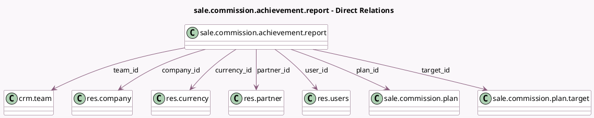

<!-- GENERATED:MODEL -->
---
tags: [odoo, enterprise, generated, model]
---

# sale.commission.achievement.report

- Module: [[docs/Enterprise Addons/sale_commission/sale_commission|sale_commission]]
- Scope: Enterprise Addons
- Defined in module: yes
- Source files: `report/achievement_report.py`
- Python classes: `SaleCommissionAchievementReport`
- Description: Sales Achievement Report

## Field footprint

- Detected fields: 15
- Field types: `Char` x 1, `Date` x 1, `Float` x 2, `Many2one` x 7, `Many2oneReference` x 1, `Monetary` x 3
- Relation fields: 7

## Sample fields

- `achieved`: `Monetary` (comodel `Achieved`)
- `commission_rate`: `Float` (comodel `Commission Rate`)
- `commission_target_amount`: `Monetary`
- `company_id`: `Many2one` (comodel `res.company`)
- `currency_id`: `Many2one` (comodel `res.currency`)
- `date`: `Date`
- `partner_id`: `Many2one` (comodel `res.partner`)
- `plan_id`: `Many2one` (comodel `sale.commission.plan`)
- `related_res_id`: `Many2oneReference` (comodel `Related`)
- `related_res_model`: `Char`
- `target_amount`: `Monetary`
- `target_id`: `Many2one` (comodel `sale.commission.plan.target`)
- `target_rate`: `Float` (comodel `Achieved Rate`)
- `team_id`: `Many2one` (comodel `crm.team`)
- `user_id`: `Many2one` (comodel `res.users`)

## Method hints

- Detected methods: 34
- Action methods: none
- Compute methods: none
- Onchange methods: none

## Direct relation diagram

## Navigation

- **Parent:** [[docs/Enterprise Addons/sale_commission/Models]]

<!-- GENERATED:MODEL -->
