<!-- GENERATED:MODEL -->
---
tags: [odoo, enterprise, generated, model]
---

# sale.commission.plan.achievement

- Module: [[docs/Enterprise Addons/sale_commission/sale_commission|sale_commission]]
- Scope: Enterprise Addons
- Defined in module: yes
- Source files: `model/commission_plan_achievement.py`
- Python classes: `SaleCommissionPlanAchievement`
- Description: Commission Plan Achievement

## Field footprint

- Detected fields: 5
- Field types: `Float` x 1, `Many2one` x 3, `Selection` x 1
- Relation fields: 3

## Sample fields

- `plan_id`: `Many2one` (comodel `sale.commission.plan`)
- `product_categ_id`: `Many2one` (comodel `product.category`)
- `product_id`: `Many2one` (comodel `product.product`)
- `rate`: `Float` (comodel `Rate`)
- `type`: `Selection`

## Method hints

- Detected methods: 1
- Action methods: none
- Compute methods: `_compute_display_name`
- Onchange methods: none

## Direct relation diagram

```plantuml
@startuml
!define ODOO_COLOR_PRIMARY #714B67
!define ODOO_COLOR_ACCENT #875A7B
!define ODOO_COLOR_BG #FAF7FA

skinparam backgroundColor ODOO_COLOR_BG
skinparam defaultTextAlignment left
skinparam ArrowColor ODOO_COLOR_ACCENT
skinparam ClassBackgroundColor white
skinparam ClassBorderColor ODOO_COLOR_PRIMARY
skinparam ComponentBackgroundColor white
skinparam ComponentBorderColor ODOO_COLOR_PRIMARY
skinparam NoteBackgroundColor #FFF8FF
skinparam NoteBorderColor ODOO_COLOR_ACCENT
skinparam SequenceLifeLineBorderColor ODOO_COLOR_ACCENT
skinparam SequenceLifeLineBackgroundColor #FFFFFF
skinparam SequenceParticipantBorderColor ODOO_COLOR_PRIMARY
skinparam SequenceParticipantBackgroundColor #FFFFFF
skinparam sequence {
  ArrowColor ODOO_COLOR_ACCENT
  ActorBorderColor ODOO_COLOR_PRIMARY
}
title sale.commission.plan.achievement - Direct Relations
class "sale.commission.plan.achievement" as sale_commission_plan_achievement
class "product.category" as product_category
class "product.product" as product_product
class "sale.commission.plan" as sale_commission_plan
sale_commission_plan_achievement --> sale_commission_plan : plan_id
sale_commission_plan_achievement --> product_product : product_id
sale_commission_plan_achievement --> product_category : product_categ_id
@enduml
```

## Navigation

- **Parent:** [[docs/Enterprise Addons/sale_commission/Models]]

<!-- GENERATED:MODEL -->
