<!-- GENERATED:MODEL -->
---
tags: [odoo, enterprise, generated, model]
---

# sale.commission.plan

- Module: [[docs/Enterprise Addons/sale_commission/sale_commission|sale_commission]]
- Scope: Enterprise Addons
- Defined in module: yes
- Source files: `model/commission_plan.py`
- Python classes: `SaleCommissionPlan`
- Description: Commission Plan
- Inherits: `mail.thread`

## Field footprint

- Detected fields: 17
- Field types: `Boolean` x 1, `Char` x 1, `Date` x 2, `Many2one` x 3, `Monetary` x 1, `One2many` x 4, `Selection` x 4, `Text` x 1
- Relation fields: 7

## Sample fields

- `achievement_ids`: `One2many` (comodel `sale.commission.plan.achievement`)
- `active`: `Boolean`
- `commission_amount`: `Monetary` (comodel `On Target Commission`)
- `company_id`: `Many2one` (comodel `res.company`)
- `currency_id`: `Many2one` (comodel `res.currency`, related `company_id.currency_id`, store `True`)
- `date_from`: `Date` (comodel `From`)
- `date_to`: `Date` (comodel `To`)
- `name`: `Char` (comodel `Name`)
- `periodicity`: `Selection`
- `state`: `Selection`
- `target_commission_graph`: `Text` (compute `_compute_target_commission_graph`)
- `target_commission_ids`: `One2many` (comodel `sale.commission.plan.target.commission`, compute `_compute_target_commission_ids`, store `True`)
- `target_ids`: `One2many` (comodel `sale.commission.plan.target`, compute `_compute_targets`, store `True`)
- `team_id`: `Many2one` (comodel `crm.team`)
- `type`: `Selection`
- `user_ids`: `One2many` (comodel `sale.commission.plan.user`)
- `user_type`: `Selection`

## Method hints

- Detected methods: 19
- Action methods: `action_approve`, `action_cancel`, `action_done`, `action_draft`, `action_export_targets`, `action_open_commission`
- Compute methods: `_compute_target_commission_graph`, `_compute_target_commission_ids`, `_compute_targets`
- Onchange methods: none

## Direct relation diagram

```plantuml
@startuml
!define ODOO_COLOR_PRIMARY #714B67
!define ODOO_COLOR_ACCENT #875A7B
!define ODOO_COLOR_BG #FAF7FA

skinparam backgroundColor ODOO_COLOR_BG
skinparam defaultTextAlignment left
skinparam ArrowColor ODOO_COLOR_ACCENT
skinparam ClassBackgroundColor white
skinparam ClassBorderColor ODOO_COLOR_PRIMARY
skinparam ComponentBackgroundColor white
skinparam ComponentBorderColor ODOO_COLOR_PRIMARY
skinparam NoteBackgroundColor #FFF8FF
skinparam NoteBorderColor ODOO_COLOR_ACCENT
skinparam SequenceLifeLineBorderColor ODOO_COLOR_ACCENT
skinparam SequenceLifeLineBackgroundColor #FFFFFF
skinparam SequenceParticipantBorderColor ODOO_COLOR_PRIMARY
skinparam SequenceParticipantBackgroundColor #FFFFFF
skinparam sequence {
  ArrowColor ODOO_COLOR_ACCENT
  ActorBorderColor ODOO_COLOR_PRIMARY
}
title sale.commission.plan - Direct Relations
class "sale.commission.plan" as sale_commission_plan
class "crm.team" as crm_team
class "res.company" as res_company
class "res.currency" as res_currency
class "sale.commission.plan.achievement" as sale_commission_plan_achievement
class "sale.commission.plan.target" as sale_commission_plan_target
class "sale.commission.plan.target.commission" as sale_commission_plan_target_commission
class "sale.commission.plan.user" as sale_commission_plan_user
sale_commission_plan --> res_company : company_id
sale_commission_plan --> res_currency : currency_id
sale_commission_plan --> crm_team : team_id
sale_commission_plan --|> sale_commission_plan_achievement : achievement_ids
sale_commission_plan --|> sale_commission_plan_target : target_ids
sale_commission_plan --|> sale_commission_plan_target_commission : target_commission_ids
sale_commission_plan --|> sale_commission_plan_user : user_ids
@enduml
```

## Navigation

- **Parent:** [[docs/Enterprise Addons/sale_commission/Models]]

<!-- GENERATED:MODEL -->
