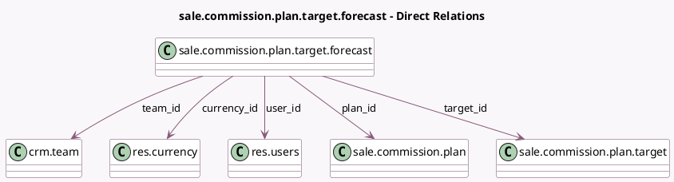

<!-- GENERATED:MODEL -->
---
tags: [odoo, enterprise, generated, model]
---

# sale.commission.plan.target.forecast

- Module: [[docs/Enterprise Addons/sale_commission/sale_commission|sale_commission]]
- Scope: Enterprise Addons
- Defined in module: yes
- Source files: `model/commission_plan_target_forecast.py`
- Python classes: `SaleCommissionPlanTargetForecast`
- Description: Commission Plan Target Forecast

## Field footprint

- Detected fields: 7
- Field types: `Many2one` x 5, `Monetary` x 1, `Text` x 1
- Relation fields: 5

## Sample fields

- `amount`: `Monetary` (comodel `Forecast`)
- `currency_id`: `Many2one` (comodel `res.currency`, related `plan_id.currency_id`)
- `notes`: `Text` (comodel `Notes`)
- `plan_id`: `Many2one` (comodel `sale.commission.plan`)
- `target_id`: `Many2one` (comodel `sale.commission.plan.target`)
- `team_id`: `Many2one` (comodel `crm.team`, related `user_id.sale_team_id`, store `True`)
- `user_id`: `Many2one` (comodel `res.users`)

## Method hints

- Detected methods: 1
- Action methods: none
- Compute methods: none
- Onchange methods: none

## Direct relation diagram

## Navigation

- **Parent:** [[docs/Enterprise Addons/sale_commission/Models]]

<!-- GENERATED:MODEL -->
