<!-- GENERATED:MODEL -->
---
tags: [odoo, enterprise, generated, model]
---

# sale.commission.plan.target

- Module: [[docs/Enterprise Addons/sale_commission/sale_commission|sale_commission]]
- Scope: Enterprise Addons
- Defined in module: yes
- Source files: `model/commission_plan_target.py`
- Python classes: `SaleCommissionPlanTarget`
- Description: Commission Plan Target

## Field footprint

- Detected fields: 8
- Field types: `Char` x 1, `Date` x 3, `Many2one` x 2, `Monetary` x 2
- Relation fields: 2

## Sample fields

- `amount`: `Monetary` (comodel `Target`)
- `currency_id`: `Many2one` (comodel `res.currency`, related `plan_id.currency_id`)
- `date_from`: `Date` (comodel `From`)
- `date_to`: `Date` (comodel `To`)
- `name`: `Char` (comodel `Period`)
- `payment_amount`: `Monetary` (compute `_compute_payment_amount`, store `True`)
- `payment_date`: `Date` (compute `_compute_payment_date`, store `True`)
- `plan_id`: `Many2one` (comodel `sale.commission.plan`)

## Method hints

- Detected methods: 2
- Action methods: none
- Compute methods: `_compute_payment_amount`, `_compute_payment_date`
- Onchange methods: none

## Direct relation diagram

```plantuml
@startuml
!define ODOO_COLOR_PRIMARY #714B67
!define ODOO_COLOR_ACCENT #875A7B
!define ODOO_COLOR_BG #FAF7FA

skinparam backgroundColor ODOO_COLOR_BG
skinparam defaultTextAlignment left
skinparam ArrowColor ODOO_COLOR_ACCENT
skinparam ClassBackgroundColor white
skinparam ClassBorderColor ODOO_COLOR_PRIMARY
skinparam ComponentBackgroundColor white
skinparam ComponentBorderColor ODOO_COLOR_PRIMARY
skinparam NoteBackgroundColor #FFF8FF
skinparam NoteBorderColor ODOO_COLOR_ACCENT
skinparam SequenceLifeLineBorderColor ODOO_COLOR_ACCENT
skinparam SequenceLifeLineBackgroundColor #FFFFFF
skinparam SequenceParticipantBorderColor ODOO_COLOR_PRIMARY
skinparam SequenceParticipantBackgroundColor #FFFFFF
skinparam sequence {
  ArrowColor ODOO_COLOR_ACCENT
  ActorBorderColor ODOO_COLOR_PRIMARY
}
title sale.commission.plan.target - Direct Relations
class "sale.commission.plan.target" as sale_commission_plan_target
class "res.currency" as res_currency
class "sale.commission.plan" as sale_commission_plan
sale_commission_plan_target --> sale_commission_plan : plan_id
sale_commission_plan_target --> res_currency : currency_id
@enduml
```

## Navigation

- **Parent:** [[docs/Enterprise Addons/sale_commission/Models]]

<!-- GENERATED:MODEL -->
