<!-- GENERATED:MODEL -->
---
tags: [odoo, enterprise, generated, model]
---

# sale.commission.plan.user

- Module: [[docs/Enterprise Addons/sale_commission/sale_commission|sale_commission]]
- Scope: Enterprise Addons
- Defined in module: yes
- Source files: `model/commission_plan_user.py`
- Python classes: `SaleCommissionPlanUser`
- Description: Commission Plan User

## Field footprint

- Detected fields: 5
- Field types: `Date` x 2, `Many2many` x 1, `Many2one` x 2
- Relation fields: 3

## Sample fields

- `date_from`: `Date` (comodel `From`, compute `_compute_date_from`, store `True`)
- `date_to`: `Date` (comodel `To`)
- `other_plans`: `Many2many` (comodel `sale.commission.plan`, compute `_compute_other_plans`)
- `plan_id`: `Many2one` (comodel `sale.commission.plan`)
- `user_id`: `Many2one` (comodel `res.users`)

## Method hints

- Detected methods: 4
- Action methods: none
- Compute methods: `_compute_date_from`, `_compute_display_name`, `_compute_other_plans`
- Onchange methods: none

## Direct relation diagram

```plantuml
@startuml
!define ODOO_COLOR_PRIMARY #714B67
!define ODOO_COLOR_ACCENT #875A7B
!define ODOO_COLOR_BG #FAF7FA

skinparam backgroundColor ODOO_COLOR_BG
skinparam defaultTextAlignment left
skinparam ArrowColor ODOO_COLOR_ACCENT
skinparam ClassBackgroundColor white
skinparam ClassBorderColor ODOO_COLOR_PRIMARY
skinparam ComponentBackgroundColor white
skinparam ComponentBorderColor ODOO_COLOR_PRIMARY
skinparam NoteBackgroundColor #FFF8FF
skinparam NoteBorderColor ODOO_COLOR_ACCENT
skinparam SequenceLifeLineBorderColor ODOO_COLOR_ACCENT
skinparam SequenceLifeLineBackgroundColor #FFFFFF
skinparam SequenceParticipantBorderColor ODOO_COLOR_PRIMARY
skinparam SequenceParticipantBackgroundColor #FFFFFF
skinparam sequence {
  ArrowColor ODOO_COLOR_ACCENT
  ActorBorderColor ODOO_COLOR_PRIMARY
}
title sale.commission.plan.user - Direct Relations
class "sale.commission.plan.user" as sale_commission_plan_user
class "res.users" as res_users
class "sale.commission.plan" as sale_commission_plan
sale_commission_plan_user --> sale_commission_plan : plan_id
sale_commission_plan_user --> res_users : user_id
sale_commission_plan_user .. sale_commission_plan : other_plans
@enduml
```

## Navigation

- **Parent:** [[docs/Enterprise Addons/sale_commission/Models]]

<!-- GENERATED:MODEL -->
