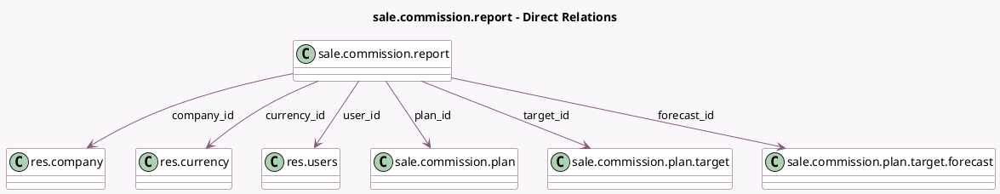

<!-- GENERATED:MODEL -->
---
tags: [odoo, enterprise, generated, model]
---

# sale.commission.report

- Module: [[docs/Enterprise Addons/sale_commission/sale_commission|sale_commission]]
- Scope: Enterprise Addons
- Defined in module: yes
- Source files: `report/commission_report.py`
- Python classes: `SaleCommissionReport`
- Description: Sales Commission Report

## Field footprint

- Detected fields: 15
- Field types: `Date` x 3, `Float` x 1, `Many2one` x 6, `Monetary` x 4, `Text` x 1
- Relation fields: 6

## Sample fields

- `achieved`: `Monetary` (comodel `Achieved`)
- `achieved_rate`: `Float` (comodel `Achieved Rate`)
- `commission`: `Monetary` (comodel `Commission`)
- `company_id`: `Many2one` (comodel `res.company`)
- `currency_id`: `Many2one` (comodel `res.currency`)
- `date_from`: `Date` (related `target_id.date_from`)
- `date_to`: `Date` (related `target_id.date_to`)
- `forecast`: `Monetary` (comodel `Forecast`)
- `forecast_id`: `Many2one` (comodel `sale.commission.plan.target.forecast`)
- `notes`: `Text` (related `forecast_id.notes`)
- `payment_date`: `Date` (comodel `Payment Date`)
- `plan_id`: `Many2one` (comodel `sale.commission.plan`)
- `target_amount`: `Monetary` (comodel `Target Amount`)
- `target_id`: `Many2one` (comodel `sale.commission.plan.target`)
- `user_id`: `Many2one` (comodel `res.users`)

## Method hints

- Detected methods: 8
- Action methods: `action_achievement_detail`
- Compute methods: none
- Onchange methods: none

## Direct relation diagram

## Navigation

- **Parent:** [[docs/Enterprise Addons/sale_commission/Models]]

<!-- GENERATED:MODEL -->
