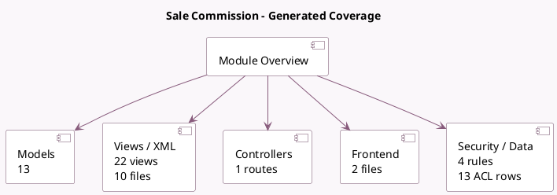

<!-- GENERATED:MODULE -->
---
tags: [odoo, enterprise, module]
---

# Sale Commission

- Scope: Enterprise Addons
- Source: enterprise/sale_commission
- Dependencies: [[docs/Community Addons/sale_management/sale_management|sale_management]]

## Summary

Manage your salespersons' commissions

## Generated coverage

- Models: 13
- XML files with UI/data artifacts: 10
- Views: 22
- Actions: 9
- Menus: 7
- Rules (ir.rule): 4
- Access CSV entries: 13
- Controller units: 1
- Frontend asset files: 2

## Module map

## Detail notes

- Models: [[docs/Enterprise Addons/sale_commission/Models|Models]] (13)
- Views and XML: [[docs/Enterprise Addons/sale_commission/Views|Views]] (10 files)
- Controllers: [[docs/Enterprise Addons/sale_commission/Controllers|Controllers]] (1)
- Frontend: [[docs/Enterprise Addons/sale_commission/Frontend|Frontend]] (2 files)

## Key models

- `crm.team`
- `res.config.settings`
- `res.users`
- `sale.commission.achievement`
- `sale.commission.achievement.report`
- `sale.commission.plan`
- `sale.commission.plan.achievement`
- `sale.commission.plan.target`
- `sale.commission.plan.target.commission`
- `sale.commission.plan.target.forecast`
- `sale.commission.plan.user`
- `sale.commission.plan.user.wizard`

## Navigation

- [[../Enterprise Addons/Enterprise Addons|Back to scope]]
- [[../../docs/docs|Back to docs]]

<!-- GENERATED:MODULE -->

