<!-- GENERATED:MODEL -->
---
tags: [odoo, enterprise, generated, model]
---

# planning.analysis.report

- Module: [[docs/Enterprise Addons/sale_planning/sale_planning|sale_planning]]
- Scope: Enterprise Addons
- Defined in module: extension only
- Source files: `report/planning_analysis_report.py`
- Python classes: `PlanningAnalysisReport`

## Field footprint

- Detected fields: 3
- Field types: `Many2one` x 2, `One2many` x 1
- Relation fields: 3

## Sample fields

- `role_product_ids`: `One2many` (comodel `product.template`, compute `_compute_role_product_ids`)
- `sale_line_id`: `Many2one` (comodel `sale.order.line`)
- `sale_order_id`: `Many2one` (comodel `sale.order`)

## Method hints

- Detected methods: 6
- Action methods: none
- Compute methods: `_compute_role_product_ids`
- Onchange methods: none

## Direct relation diagram

```plantuml
@startuml
!define ODOO_COLOR_PRIMARY #714B67
!define ODOO_COLOR_ACCENT #875A7B
!define ODOO_COLOR_BG #FAF7FA

skinparam backgroundColor ODOO_COLOR_BG
skinparam defaultTextAlignment left
skinparam ArrowColor ODOO_COLOR_ACCENT
skinparam ClassBackgroundColor white
skinparam ClassBorderColor ODOO_COLOR_PRIMARY
skinparam ComponentBackgroundColor white
skinparam ComponentBorderColor ODOO_COLOR_PRIMARY
skinparam NoteBackgroundColor #FFF8FF
skinparam NoteBorderColor ODOO_COLOR_ACCENT
skinparam SequenceLifeLineBorderColor ODOO_COLOR_ACCENT
skinparam SequenceLifeLineBackgroundColor #FFFFFF
skinparam SequenceParticipantBorderColor ODOO_COLOR_PRIMARY
skinparam SequenceParticipantBackgroundColor #FFFFFF
skinparam sequence {
  ArrowColor ODOO_COLOR_ACCENT
  ActorBorderColor ODOO_COLOR_PRIMARY
}
title planning.analysis.report - Direct Relations
class "planning.analysis.report" as planning_analysis_report
class "product.template" as product_template
class "sale.order" as sale_order
class "sale.order.line" as sale_order_line
planning_analysis_report --> sale_order : sale_order_id
planning_analysis_report --> sale_order_line : sale_line_id
planning_analysis_report --|> product_template : role_product_ids
@enduml
```

## Navigation

- **Parent:** [[docs/Enterprise Addons/sale_planning/Models]]

<!-- GENERATED:MODEL -->
