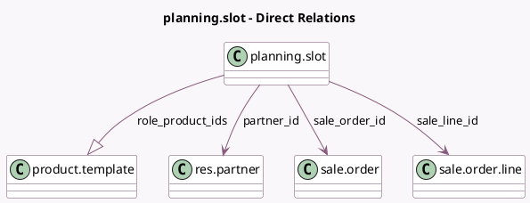

<!-- GENERATED:MODEL -->
---
tags: [odoo, enterprise, generated, model]
---

# planning.slot

- Module: [[docs/Enterprise Addons/sale_planning/sale_planning|sale_planning]]
- Scope: Enterprise Addons
- Defined in module: extension only
- Source files: `models/planning_slot.py`
- Python classes: `PlanningSlot`

## Field footprint

- Detected fields: 9
- Field types: `Boolean` x 1, `Datetime` x 2, `Float` x 1, `Many2one` x 3, `One2many` x 1, `Selection` x 1
- Relation fields: 4

## Sample fields

- `allocated_hours`: `Float`
- `end_datetime`: `Datetime`
- `partner_id`: `Many2one` (comodel `res.partner`, related `sale_order_id.partner_id`)
- `role_product_ids`: `One2many` (comodel `product.template`, related `role_id.product_ids`)
- `sale_line_id`: `Many2one` (comodel `sale.order.line`)
- `sale_line_plannable`: `Boolean` (related `sale_line_id.product_id.planning_enabled`)
- `sale_order_id`: `Many2one` (comodel `sale.order`, related `sale_line_id.order_id`, store `True`)
- `sale_order_state`: `Selection` (related `sale_order_id.state`)
- `start_datetime`: `Datetime`

## Method hints

- Detected methods: 40
- Action methods: `action_rollback_auto_plan_ids`, `action_unschedule`, `action_view_sale_order`
- Compute methods: `_compute_allocated_hours`, `_compute_allocated_percentage`, `_compute_is_unassign_deadline_passed`, `_compute_past_shift`, `_compute_role_id`, `_compute_template_autocomplete_ids`, `_compute_unassign_deadline`
- Onchange methods: none

## Direct relation diagram

## Navigation

- **Parent:** [[docs/Enterprise Addons/sale_planning/Models]]

<!-- GENERATED:MODEL -->
