<!-- GENERATED:MODEL -->
---
tags: [odoo, enterprise, generated, model]
---

# sale.order

- Module: [[docs/Enterprise Addons/sale_planning/sale_planning|sale_planning]]
- Scope: Enterprise Addons
- Defined in module: extension only
- Source files: `models/sale_order.py`
- Python classes: `SaleOrder`

## Field footprint

- Detected fields: 4
- Field types: `Date` x 1, `Float` x 2, `Many2one` x 1
- Relation fields: 1

## Sample fields

- `planning_first_sale_line_id`: `Many2one` (comodel `sale.order.line`, compute `_compute_planning_first_sale_line_id`)
- `planning_hours_planned`: `Float` (compute `_compute_planning_hours`)
- `planning_hours_to_plan`: `Float` (compute `_compute_planning_hours`)
- `planning_initial_date`: `Date` (compute `_compute_planning_initial_date`)

## Method hints

- Detected methods: 8
- Action methods: `action_view_planning`
- Compute methods: `_compute_planning_first_sale_line_id`, `_compute_planning_hours`, `_compute_planning_initial_date`
- Onchange methods: none

## Direct relation diagram

```plantuml
@startuml
!define ODOO_COLOR_PRIMARY #714B67
!define ODOO_COLOR_ACCENT #875A7B
!define ODOO_COLOR_BG #FAF7FA

skinparam backgroundColor ODOO_COLOR_BG
skinparam defaultTextAlignment left
skinparam ArrowColor ODOO_COLOR_ACCENT
skinparam ClassBackgroundColor white
skinparam ClassBorderColor ODOO_COLOR_PRIMARY
skinparam ComponentBackgroundColor white
skinparam ComponentBorderColor ODOO_COLOR_PRIMARY
skinparam NoteBackgroundColor #FFF8FF
skinparam NoteBorderColor ODOO_COLOR_ACCENT
skinparam SequenceLifeLineBorderColor ODOO_COLOR_ACCENT
skinparam SequenceLifeLineBackgroundColor #FFFFFF
skinparam SequenceParticipantBorderColor ODOO_COLOR_PRIMARY
skinparam SequenceParticipantBackgroundColor #FFFFFF
skinparam sequence {
  ArrowColor ODOO_COLOR_ACCENT
  ActorBorderColor ODOO_COLOR_PRIMARY
}
title sale.order - Direct Relations
class "sale.order" as sale_order
class "sale.order.line" as sale_order_line
sale_order --> sale_order_line : planning_first_sale_line_id
@enduml
```

## Navigation

- **Parent:** [[docs/Enterprise Addons/sale_planning/Models]]

<!-- GENERATED:MODEL -->
