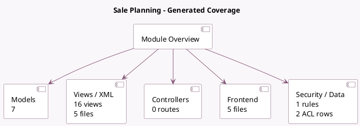

<!-- GENERATED:MODULE -->
---
tags: [odoo, enterprise, module]
---

# Sale Planning

- Scope: Enterprise Addons
- Source: enterprise/sale_planning
- Dependencies: [[docs/Community Addons/sale_management/sale_management|sale_management]], [[docs/Community Addons/sale_service/sale_service|sale_service]], [[docs/Enterprise Addons/planning/planning|planning]]

## Generated coverage

- Models: 7
- XML files with UI/data artifacts: 5
- Views: 16
- Actions: 10
- Menus: 1
- Rules (ir.rule): 1
- Access CSV entries: 2
- Controller units: 0
- Frontend asset files: 5

## Module map

## Detail notes

- Models: [[docs/Enterprise Addons/sale_planning/Models|Models]] (7)
- Views and XML: [[docs/Enterprise Addons/sale_planning/Views|Views]] (5 files)
- Frontend: [[docs/Enterprise Addons/sale_planning/Frontend|Frontend]] (5 files)

## Key models

- `planning.analysis.report`
- `planning.role`
- `planning.slot`
- `product.template`
- `sale.order`
- `sale.order.line`
- `uom.uom`

## Navigation

- [[../Enterprise Addons/Enterprise Addons|Back to scope]]
- [[../../docs/docs|Back to docs]]

<!-- GENERATED:MODULE -->

