<!-- GENERATED:MODEL -->
---
tags: [odoo, enterprise, generated, model]
---

# res.company

- Module: [[docs/Enterprise Addons/sale_purchase_stock_inter_company_rules/sale_purchase_stock_inter_company_rules|sale_purchase_stock_inter_company_rules]]
- Scope: Enterprise Addons
- Defined in module: extension only
- Source files: `models/res_company.py`
- Python classes: `ResCompany`

## Field footprint

- Detected fields: 3
- Field types: `Boolean` x 1, `Many2one` x 2
- Relation fields: 2

## Sample fields

- `intercompany_receipt_type_id`: `Many2one` (comodel `stock.picking.type`, compute `_compute_intercompany_stock_fields`, store `True`)
- `intercompany_sync_delivery_receipt`: `Boolean`
- `intercompany_warehouse_id`: `Many2one` (comodel `stock.warehouse`, compute `_compute_intercompany_stock_fields`, store `True`)

## Method hints

- Detected methods: 1
- Action methods: none
- Compute methods: `_compute_intercompany_stock_fields`
- Onchange methods: none

## Direct relation diagram

```plantuml
@startuml
!define ODOO_COLOR_PRIMARY #714B67
!define ODOO_COLOR_ACCENT #875A7B
!define ODOO_COLOR_BG #FAF7FA

skinparam backgroundColor ODOO_COLOR_BG
skinparam defaultTextAlignment left
skinparam ArrowColor ODOO_COLOR_ACCENT
skinparam ClassBackgroundColor white
skinparam ClassBorderColor ODOO_COLOR_PRIMARY
skinparam ComponentBackgroundColor white
skinparam ComponentBorderColor ODOO_COLOR_PRIMARY
skinparam NoteBackgroundColor #FFF8FF
skinparam NoteBorderColor ODOO_COLOR_ACCENT
skinparam SequenceLifeLineBorderColor ODOO_COLOR_ACCENT
skinparam SequenceLifeLineBackgroundColor #FFFFFF
skinparam SequenceParticipantBorderColor ODOO_COLOR_PRIMARY
skinparam SequenceParticipantBackgroundColor #FFFFFF
skinparam sequence {
  ArrowColor ODOO_COLOR_ACCENT
  ActorBorderColor ODOO_COLOR_PRIMARY
}
title res.company - Direct Relations
class "res.company" as res_company
class "stock.picking.type" as stock_picking_type
class "stock.warehouse" as stock_warehouse
res_company --> stock_warehouse : intercompany_warehouse_id
res_company --> stock_picking_type : intercompany_receipt_type_id
@enduml
```

## Navigation

- **Parent:** [[docs/Enterprise Addons/sale_purchase_stock_inter_company_rules/Models]]

<!-- GENERATED:MODEL -->
