<!-- GENERATED:MODEL -->
---
tags: [odoo, enterprise, generated, model]
---

# product.pricelist

- Module: [[docs/Enterprise Addons/sale_renting/sale_renting|sale_renting]]
- Scope: Enterprise Addons
- Defined in module: extension only
- Source files: `models/product_pricelist.py`
- Python classes: `ProductPricelist`

## Field footprint

- Detected fields: 1
- Field types: `One2many` x 1
- Relation fields: 1

## Sample fields

- `product_pricing_ids`: `One2many` (comodel `product.pricing`)

## Method hints

- Detected methods: 3
- Action methods: none
- Compute methods: `_compute_price_rule`
- Onchange methods: none

## Direct relation diagram

```plantuml
@startuml
!define ODOO_COLOR_PRIMARY #714B67
!define ODOO_COLOR_ACCENT #875A7B
!define ODOO_COLOR_BG #FAF7FA

skinparam backgroundColor ODOO_COLOR_BG
skinparam defaultTextAlignment left
skinparam ArrowColor ODOO_COLOR_ACCENT
skinparam ClassBackgroundColor white
skinparam ClassBorderColor ODOO_COLOR_PRIMARY
skinparam ComponentBackgroundColor white
skinparam ComponentBorderColor ODOO_COLOR_PRIMARY
skinparam NoteBackgroundColor #FFF8FF
skinparam NoteBorderColor ODOO_COLOR_ACCENT
skinparam SequenceLifeLineBorderColor ODOO_COLOR_ACCENT
skinparam SequenceLifeLineBackgroundColor #FFFFFF
skinparam SequenceParticipantBorderColor ODOO_COLOR_PRIMARY
skinparam SequenceParticipantBackgroundColor #FFFFFF
skinparam sequence {
  ArrowColor ODOO_COLOR_ACCENT
  ActorBorderColor ODOO_COLOR_PRIMARY
}
title product.pricelist - Direct Relations
class "product.pricelist" as product_pricelist
class "product.pricing" as product_pricing
product_pricelist --|> product_pricing : product_pricing_ids
@enduml
```

## Navigation

- **Parent:** [[docs/Enterprise Addons/sale_renting/Models]]

<!-- GENERATED:MODEL -->
