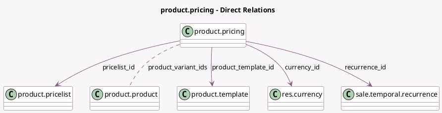

<!-- GENERATED:MODEL -->
---
tags: [odoo, enterprise, generated, model]
---

# product.pricing

- Module: [[docs/Enterprise Addons/sale_renting/sale_renting|sale_renting]]
- Scope: Enterprise Addons
- Defined in module: yes
- Source files: `models/product_pricing.py`
- Python classes: `ProductPricing`
- Description: Pricing rule of rental products

## Field footprint

- Detected fields: 9
- Field types: `Char` x 2, `Many2many` x 1, `Many2one` x 5, `Monetary` x 1
- Relation fields: 6

## Sample fields

- `company_id`: `Many2one` (related `pricelist_id.company_id`)
- `currency_id`: `Many2one` (comodel `res.currency`, compute `_compute_currency_id`, store `True`)
- `description`: `Char` (compute `_compute_description`)
- `name`: `Char` (related `recurrence_id.duration_display`)
- `price`: `Monetary`
- `pricelist_id`: `Many2one` (comodel `product.pricelist`)
- `product_template_id`: `Many2one` (comodel `product.template`)
- `product_variant_ids`: `Many2many` (comodel `product.product`)
- `recurrence_id`: `Many2one` (comodel `sale.temporal.recurrence`)

## Method hints

- Detected methods: 10
- Action methods: none
- Compute methods: `_compute_currency_id`, `_compute_description`, `_compute_duration_vals`, `_compute_price`
- Onchange methods: none

## Direct relation diagram

## Navigation

- **Parent:** [[docs/Enterprise Addons/sale_renting/Models]]

<!-- GENERATED:MODEL -->
