<!-- GENERATED:MODEL -->
---
tags: [odoo, enterprise, generated, model]
---

# product.template

- Module: [[docs/Enterprise Addons/sale_renting/sale_renting|sale_renting]]
- Scope: Enterprise Addons
- Defined in module: extension only
- Source files: `models/product_template.py`
- Python classes: `ProductTemplate`

## Field footprint

- Detected fields: 6
- Field types: `Boolean` x 1, `Char` x 1, `Float` x 3, `One2many` x 1
- Relation fields: 1

## Sample fields

- `display_price`: `Char` (compute `_compute_display_price`)
- `extra_daily`: `Float` (comodel `Daily Fine`)
- `extra_hourly`: `Float` (comodel `Hourly Fine`)
- `product_pricing_ids`: `One2many` (comodel `product.pricing`)
- `qty_in_rent`: `Float` (comodel `Quantity currently in rent`, compute `_get_qty_in_rent`)
- `rent_ok`: `Boolean`

## Method hints

- Detected methods: 11
- Action methods: `action_view_rentals`
- Compute methods: `_compute_display_name`, `_compute_display_price`
- Onchange methods: none

## Direct relation diagram

```plantuml
@startuml
!define ODOO_COLOR_PRIMARY #714B67
!define ODOO_COLOR_ACCENT #875A7B
!define ODOO_COLOR_BG #FAF7FA

skinparam backgroundColor ODOO_COLOR_BG
skinparam defaultTextAlignment left
skinparam ArrowColor ODOO_COLOR_ACCENT
skinparam ClassBackgroundColor white
skinparam ClassBorderColor ODOO_COLOR_PRIMARY
skinparam ComponentBackgroundColor white
skinparam ComponentBorderColor ODOO_COLOR_PRIMARY
skinparam NoteBackgroundColor #FFF8FF
skinparam NoteBorderColor ODOO_COLOR_ACCENT
skinparam SequenceLifeLineBorderColor ODOO_COLOR_ACCENT
skinparam SequenceLifeLineBackgroundColor #FFFFFF
skinparam SequenceParticipantBorderColor ODOO_COLOR_PRIMARY
skinparam SequenceParticipantBackgroundColor #FFFFFF
skinparam sequence {
  ArrowColor ODOO_COLOR_ACCENT
  ActorBorderColor ODOO_COLOR_PRIMARY
}
title product.template - Direct Relations
class "product.template" as product_template
class "product.pricing" as product_pricing
product_template --|> product_pricing : product_pricing_ids
@enduml
```

## Navigation

- **Parent:** [[docs/Enterprise Addons/sale_renting/Models]]

<!-- GENERATED:MODEL -->
