<!-- GENERATED:MODEL -->
---
tags: [odoo, enterprise, generated, model]
---

# rental.order.wizard.line

- Module: [[docs/Enterprise Addons/sale_renting/sale_renting|sale_renting]]
- Scope: Enterprise Addons
- Defined in module: yes
- Source files: `wizard/rental_processing.py`
- Python classes: `RentalOrderWizardLine`
- Description: RentalOrderLine transient representation

## Field footprint

- Detected fields: 7
- Field types: `Float` x 3, `Many2one` x 3, `Selection` x 1
- Relation fields: 3

## Sample fields

- `order_line_id`: `Many2one` (comodel `sale.order.line`)
- `product_id`: `Many2one` (comodel `product.product`)
- `qty_delivered`: `Float` (comodel `Picked-up`)
- `qty_reserved`: `Float` (comodel `Reserved`)
- `qty_returned`: `Float` (comodel `Returned`)
- `rental_order_wizard_id`: `Many2one` (comodel `rental.order.wizard`)
- `status`: `Selection` (related `rental_order_wizard_id.status`)

## Method hints

- Detected methods: 5
- Action methods: none
- Compute methods: none
- Onchange methods: none

## Direct relation diagram

```plantuml
@startuml
!define ODOO_COLOR_PRIMARY #714B67
!define ODOO_COLOR_ACCENT #875A7B
!define ODOO_COLOR_BG #FAF7FA

skinparam backgroundColor ODOO_COLOR_BG
skinparam defaultTextAlignment left
skinparam ArrowColor ODOO_COLOR_ACCENT
skinparam ClassBackgroundColor white
skinparam ClassBorderColor ODOO_COLOR_PRIMARY
skinparam ComponentBackgroundColor white
skinparam ComponentBorderColor ODOO_COLOR_PRIMARY
skinparam NoteBackgroundColor #FFF8FF
skinparam NoteBorderColor ODOO_COLOR_ACCENT
skinparam SequenceLifeLineBorderColor ODOO_COLOR_ACCENT
skinparam SequenceLifeLineBackgroundColor #FFFFFF
skinparam SequenceParticipantBorderColor ODOO_COLOR_PRIMARY
skinparam SequenceParticipantBackgroundColor #FFFFFF
skinparam sequence {
  ArrowColor ODOO_COLOR_ACCENT
  ActorBorderColor ODOO_COLOR_PRIMARY
}
title rental.order.wizard.line - Direct Relations
class "rental.order.wizard.line" as rental_order_wizard_line
class "product.product" as product_product
class "rental.order.wizard" as rental_order_wizard
class "sale.order.line" as sale_order_line
rental_order_wizard_line --> rental_order_wizard : rental_order_wizard_id
rental_order_wizard_line --> sale_order_line : order_line_id
rental_order_wizard_line --> product_product : product_id
@enduml
```

## Navigation

- **Parent:** [[docs/Enterprise Addons/sale_renting/Models]]

<!-- GENERATED:MODEL -->
