<!-- GENERATED:MODEL -->
---
tags: [odoo, enterprise, generated, model]
---

# rental.order.wizard

- Module: [[docs/Enterprise Addons/sale_renting/sale_renting|sale_renting]]
- Scope: Enterprise Addons
- Defined in module: yes
- Source files: `wizard/rental_processing.py`
- Python classes: `RentalOrderWizard`
- Description: Pick-up/Return products

## Field footprint

- Detected fields: 4
- Field types: `Boolean` x 1, `Many2one` x 1, `One2many` x 1, `Selection` x 1
- Relation fields: 2

## Sample fields

- `is_late`: `Boolean` (compute `_compute_is_late`)
- `order_id`: `Many2one` (comodel `sale.order`)
- `rental_wizard_line_ids`: `One2many` (comodel `rental.order.wizard.line`)
- `status`: `Selection`

## Method hints

- Detected methods: 3
- Action methods: none
- Compute methods: `_compute_is_late`
- Onchange methods: `_get_wizard_lines`

## Direct relation diagram

```plantuml
@startuml
!define ODOO_COLOR_PRIMARY #714B67
!define ODOO_COLOR_ACCENT #875A7B
!define ODOO_COLOR_BG #FAF7FA

skinparam backgroundColor ODOO_COLOR_BG
skinparam defaultTextAlignment left
skinparam ArrowColor ODOO_COLOR_ACCENT
skinparam ClassBackgroundColor white
skinparam ClassBorderColor ODOO_COLOR_PRIMARY
skinparam ComponentBackgroundColor white
skinparam ComponentBorderColor ODOO_COLOR_PRIMARY
skinparam NoteBackgroundColor #FFF8FF
skinparam NoteBorderColor ODOO_COLOR_ACCENT
skinparam SequenceLifeLineBorderColor ODOO_COLOR_ACCENT
skinparam SequenceLifeLineBackgroundColor #FFFFFF
skinparam SequenceParticipantBorderColor ODOO_COLOR_PRIMARY
skinparam SequenceParticipantBackgroundColor #FFFFFF
skinparam sequence {
  ArrowColor ODOO_COLOR_ACCENT
  ActorBorderColor ODOO_COLOR_PRIMARY
}
title rental.order.wizard - Direct Relations
class "rental.order.wizard" as rental_order_wizard
class "rental.order.wizard.line" as rental_order_wizard_line
class "sale.order" as sale_order
rental_order_wizard --> sale_order : order_id
rental_order_wizard --|> rental_order_wizard_line : rental_wizard_line_ids
@enduml
```

## Navigation

- **Parent:** [[docs/Enterprise Addons/sale_renting/Models]]

<!-- GENERATED:MODEL -->
