<!-- GENERATED:MODEL -->
---
tags: [odoo, enterprise, generated, model]
---

# sale.order.line

- Module: [[docs/Enterprise Addons/sale_renting/sale_renting|sale_renting]]
- Scope: Enterprise Addons
- Defined in module: extension only
- Source files: `models/sale_order_line.py`
- Python classes: `SaleOrderLine`

## Field footprint

- Detected fields: 13
- Field types: `Boolean` x 4, `Datetime` x 3, `Float` x 1, `Integer` x 1, `Many2one` x 3, `Selection` x 1
- Relation fields: 3

## Sample fields

- `country_id`: `Many2one` (related `order_id.partner_id.country_id`)
- `is_late`: `Boolean` (related `order_id.is_late`)
- `is_product_rentable`: `Boolean` (related `product_id.rent_ok`)
- `is_rental`: `Boolean` (compute `_compute_is_rental`, store `True`)
- `order_is_rental`: `Boolean` (related `order_id.is_rental_order`)
- `product_id`: `Many2one`
- `qty_returned`: `Float` (comodel `Returned`)
- `rental_color`: `Integer` (compute `_compute_rental_color`)
- `rental_status`: `Selection` (compute `_compute_rental_status`)
- `reservation_begin`: `Datetime` (compute `_compute_reservation_begin`, store `True`)
- `return_date`: `Datetime` (related `order_id.rental_return_date`)
- `start_date`: `Datetime` (related `order_id.rental_start_date`)
- `team_id`: `Many2one` (related `order_id.team_id`)

## Method hints

- Detected methods: 22
- Action methods: none
- Compute methods: `_compute_display_name`, `_compute_is_rental`, `_compute_name`, `_compute_pricelist_item_id`, `_compute_product_updatable`, `_compute_qty_delivered_method`, `_compute_rental_color`, `_compute_rental_status`, and 1 more
- Onchange methods: `_onchange_qty_delivered`

## Direct relation diagram

```plantuml
@startuml
!define ODOO_COLOR_PRIMARY #714B67
!define ODOO_COLOR_ACCENT #875A7B
!define ODOO_COLOR_BG #FAF7FA

skinparam backgroundColor ODOO_COLOR_BG
skinparam defaultTextAlignment left
skinparam ArrowColor ODOO_COLOR_ACCENT
skinparam ClassBackgroundColor white
skinparam ClassBorderColor ODOO_COLOR_PRIMARY
skinparam ComponentBackgroundColor white
skinparam ComponentBorderColor ODOO_COLOR_PRIMARY
skinparam NoteBackgroundColor #FFF8FF
skinparam NoteBorderColor ODOO_COLOR_ACCENT
skinparam SequenceLifeLineBorderColor ODOO_COLOR_ACCENT
skinparam SequenceLifeLineBackgroundColor #FFFFFF
skinparam SequenceParticipantBorderColor ODOO_COLOR_PRIMARY
skinparam SequenceParticipantBackgroundColor #FFFFFF
skinparam sequence {
  ArrowColor ODOO_COLOR_ACCENT
  ActorBorderColor ODOO_COLOR_PRIMARY
}
title sale.order.line - Direct Relations
class "sale.order.line" as sale_order_line
@enduml
```

## Navigation

- **Parent:** [[docs/Enterprise Addons/sale_renting/Models]]

<!-- GENERATED:MODEL -->
