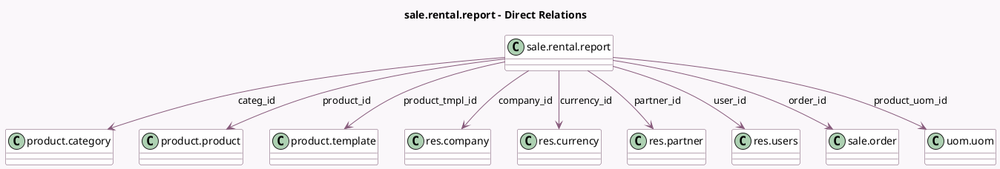

<!-- GENERATED:MODEL -->
---
tags: [odoo, enterprise, generated, model]
---

# sale.rental.report

- Module: [[docs/Enterprise Addons/sale_renting/sale_renting|sale_renting]]
- Scope: Enterprise Addons
- Defined in module: yes
- Source files: `report/rental_report.py`
- Python classes: `SaleRentalReport`
- Description: Rental Analysis Report

## Field footprint

- Detected fields: 15
- Field types: `Date` x 1, `Float` x 4, `Many2one` x 9, `Selection` x 1
- Relation fields: 9

## Sample fields

- `categ_id`: `Many2one` (comodel `product.category`)
- `company_id`: `Many2one` (comodel `res.company`)
- `currency_id`: `Many2one` (comodel `res.currency`)
- `date`: `Date` (comodel `Date`)
- `order_id`: `Many2one` (comodel `sale.order`)
- `partner_id`: `Many2one` (comodel `res.partner`)
- `price`: `Float` (comodel `Daily Amount`)
- `product_id`: `Many2one` (comodel `product.product`)
- `product_tmpl_id`: `Many2one` (comodel `product.template`)
- `product_uom_id`: `Many2one` (comodel `uom.uom`)
- `qty_delivered`: `Float` (comodel `Daily Picked-Up Qty`)
- `qty_returned`: `Float` (comodel `Daily Returned Qty`)
- `quantity`: `Float` (comodel `Daily Ordered Qty`)
- `state`: `Selection`
- `user_id`: `Many2one` (comodel `res.users`)

## Method hints

- Detected methods: 6
- Action methods: none
- Compute methods: none
- Onchange methods: none

## Direct relation diagram

## Navigation

- **Parent:** [[docs/Enterprise Addons/sale_renting/Models]]

<!-- GENERATED:MODEL -->
