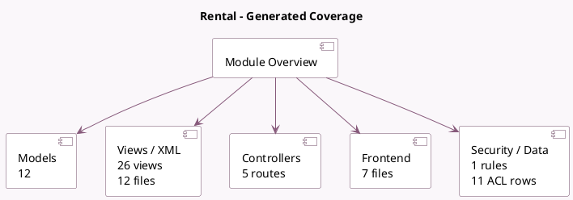

<!-- GENERATED:MODULE -->
---
tags: [odoo, enterprise, module]
---

# Rental

- Scope: Enterprise Addons
- Source: enterprise/sale_renting
- Dependencies: [[docs/Community Addons/sale/sale|sale]], [[docs/Enterprise Addons/web_gantt/web_gantt|web_gantt]]

## Summary

Manage rental contracts, deliveries and returns

## Generated coverage

- Models: 12
- XML files with UI/data artifacts: 12
- Views: 26
- Actions: 25
- Menus: 13
- Rules (ir.rule): 1
- Access CSV entries: 11
- Controller units: 2
- Frontend asset files: 7

## Module map

## Detail notes

- Models: [[docs/Enterprise Addons/sale_renting/Models|Models]] (12)
- Views and XML: [[docs/Enterprise Addons/sale_renting/Views|Views]] (12 files)
- Controllers: [[docs/Enterprise Addons/sale_renting/Controllers|Controllers]] (2)
- Frontend: [[docs/Enterprise Addons/sale_renting/Frontend|Frontend]] (7 files)

## Key models

- `product.pricelist`
- `product.pricing`
- `product.product`
- `product.template`
- `rental.order.wizard`
- `rental.order.wizard.line`
- `res.company`
- `res.config.settings`
- `sale.order`
- `sale.order.line`
- `sale.rental.report`
- `sale.temporal.recurrence`

## Navigation

- [[../Enterprise Addons/Enterprise Addons|Back to scope]]
- [[../../docs/docs|Back to docs]]

<!-- GENERATED:MODULE -->

