<!-- GENERATED:MODEL -->
---
tags: [odoo, enterprise, generated, model]
---

# crm.lead.rental

- Module: [[docs/Enterprise Addons/sale_renting_crm/sale_renting_crm|sale_renting_crm]]
- Scope: Enterprise Addons
- Defined in module: yes
- Source files: `wizard/crm_lead_rental.py`
- Python classes: `CrmLeadRental`
- Description: Convert Lead to Rental Order

## Field footprint

- Detected fields: 3
- Field types: `Many2one` x 2, `Selection` x 1
- Relation fields: 2

## Sample fields

- `action`: `Selection`
- `lead_id`: `Many2one` (comodel `crm.lead`)
- `partner_id`: `Many2one` (comodel `res.partner`)

## Method hints

- Detected methods: 2
- Action methods: `action_new_rental`
- Compute methods: none
- Onchange methods: none

## Direct relation diagram

```plantuml
@startuml
!define ODOO_COLOR_PRIMARY #714B67
!define ODOO_COLOR_ACCENT #875A7B
!define ODOO_COLOR_BG #FAF7FA

skinparam backgroundColor ODOO_COLOR_BG
skinparam defaultTextAlignment left
skinparam ArrowColor ODOO_COLOR_ACCENT
skinparam ClassBackgroundColor white
skinparam ClassBorderColor ODOO_COLOR_PRIMARY
skinparam ComponentBackgroundColor white
skinparam ComponentBorderColor ODOO_COLOR_PRIMARY
skinparam NoteBackgroundColor #FFF8FF
skinparam NoteBorderColor ODOO_COLOR_ACCENT
skinparam SequenceLifeLineBorderColor ODOO_COLOR_ACCENT
skinparam SequenceLifeLineBackgroundColor #FFFFFF
skinparam SequenceParticipantBorderColor ODOO_COLOR_PRIMARY
skinparam SequenceParticipantBackgroundColor #FFFFFF
skinparam sequence {
  ArrowColor ODOO_COLOR_ACCENT
  ActorBorderColor ODOO_COLOR_PRIMARY
}
title crm.lead.rental - Direct Relations
class "crm.lead.rental" as crm_lead_rental
class "crm.lead" as crm_lead
class "res.partner" as res_partner
crm_lead_rental --> crm_lead : lead_id
crm_lead_rental --> res_partner : partner_id
@enduml
```

## Navigation

- **Parent:** [[docs/Enterprise Addons/sale_renting_crm/Models]]

<!-- GENERATED:MODEL -->
