<!-- GENERATED:MODEL -->
---
tags: [odoo, enterprise, generated, model]
---

# sale.order

- Module: [[docs/Enterprise Addons/sale_shopee/sale_shopee|sale_shopee]]
- Scope: Enterprise Addons
- Defined in module: extension only
- Source files: `models/sale_order.py`
- Python classes: `SaleOrder`

## Field footprint

- Detected fields: 4
- Field types: `Char` x 1, `Many2one` x 1, `Selection` x 2
- Relation fields: 1

## Sample fields

- `shopee_delivery_status`: `Selection`
- `shopee_fulfillment_type`: `Selection`
- `shopee_order_ref`: `Char`
- `shopee_shop_id`: `Many2one` (comodel `shopee.shop`)

## Method hints

- Detected methods: 0
- Action methods: none
- Compute methods: none
- Onchange methods: none

## Direct relation diagram

```plantuml
@startuml
!define ODOO_COLOR_PRIMARY #714B67
!define ODOO_COLOR_ACCENT #875A7B
!define ODOO_COLOR_BG #FAF7FA

skinparam backgroundColor ODOO_COLOR_BG
skinparam defaultTextAlignment left
skinparam ArrowColor ODOO_COLOR_ACCENT
skinparam ClassBackgroundColor white
skinparam ClassBorderColor ODOO_COLOR_PRIMARY
skinparam ComponentBackgroundColor white
skinparam ComponentBorderColor ODOO_COLOR_PRIMARY
skinparam NoteBackgroundColor #FFF8FF
skinparam NoteBorderColor ODOO_COLOR_ACCENT
skinparam SequenceLifeLineBorderColor ODOO_COLOR_ACCENT
skinparam SequenceLifeLineBackgroundColor #FFFFFF
skinparam SequenceParticipantBorderColor ODOO_COLOR_PRIMARY
skinparam SequenceParticipantBackgroundColor #FFFFFF
skinparam sequence {
  ArrowColor ODOO_COLOR_ACCENT
  ActorBorderColor ODOO_COLOR_PRIMARY
}
title sale.order - Direct Relations
class "sale.order" as sale_order
class "shopee.shop" as shopee_shop
sale_order --> shopee_shop : shopee_shop_id
@enduml
```

## Navigation

- **Parent:** [[docs/Enterprise Addons/sale_shopee/Models]]

<!-- GENERATED:MODEL -->
