<!-- GENERATED:MODEL -->
---
tags: [odoo, enterprise, generated, model]
---

# shopee.account

- Module: [[docs/Enterprise Addons/sale_shopee/sale_shopee|sale_shopee]]
- Scope: Enterprise Addons
- Defined in module: yes
- Source files: `models/shopee_account.py`
- Python classes: `ShopeeAccount`
- Description: Shopee Account

## Field footprint

- Detected fields: 7
- Field types: `Char` x 2, `Integer` x 2, `Many2many` x 1, `One2many` x 1, `Selection` x 1
- Relation fields: 2

## Sample fields

- `api_endpoint`: `Selection`
- `company_ids`: `Many2many` (comodel `res.company`)
- `name`: `Char`
- `partner_identifier`: `Integer`
- `partner_key`: `Char`
- `shop_count`: `Integer` (compute `_compute_shop_count`)
- `shop_ids`: `One2many` (comodel `shopee.shop`)

## Method hints

- Detected methods: 6
- Action methods: `action_open_auth_link`, `action_view_shops`
- Compute methods: `_compute_shop_count`
- Onchange methods: `_onchange_api_endpoint`

## Direct relation diagram

```plantuml
@startuml
!define ODOO_COLOR_PRIMARY #714B67
!define ODOO_COLOR_ACCENT #875A7B
!define ODOO_COLOR_BG #FAF7FA

skinparam backgroundColor ODOO_COLOR_BG
skinparam defaultTextAlignment left
skinparam ArrowColor ODOO_COLOR_ACCENT
skinparam ClassBackgroundColor white
skinparam ClassBorderColor ODOO_COLOR_PRIMARY
skinparam ComponentBackgroundColor white
skinparam ComponentBorderColor ODOO_COLOR_PRIMARY
skinparam NoteBackgroundColor #FFF8FF
skinparam NoteBorderColor ODOO_COLOR_ACCENT
skinparam SequenceLifeLineBorderColor ODOO_COLOR_ACCENT
skinparam SequenceLifeLineBackgroundColor #FFFFFF
skinparam SequenceParticipantBorderColor ODOO_COLOR_PRIMARY
skinparam SequenceParticipantBackgroundColor #FFFFFF
skinparam sequence {
  ArrowColor ODOO_COLOR_ACCENT
  ActorBorderColor ODOO_COLOR_PRIMARY
}
title shopee.account - Direct Relations
class "shopee.account" as shopee_account
class "res.company" as res_company
class "shopee.shop" as shopee_shop
shopee_account .. res_company : company_ids
shopee_account --|> shopee_shop : shop_ids
@enduml
```

## Navigation

- **Parent:** [[docs/Enterprise Addons/sale_shopee/Models]]

<!-- GENERATED:MODEL -->
