<!-- GENERATED:MODEL -->
---
tags: [odoo, enterprise, generated, model]
---

# shopee.item

- Module: [[docs/Enterprise Addons/sale_shopee/sale_shopee|sale_shopee]]
- Scope: Enterprise Addons
- Defined in module: yes
- Source files: `models/shopee_item.py`
- Python classes: `ShopeeItem`
- Description: Shopee Item

## Field footprint

- Detected fields: 7
- Field types: `Boolean` x 1, `Char` x 2, `Datetime` x 1, `Many2one` x 3
- Relation fields: 3

## Sample fields

- `company_id`: `Many2one` (related `shop_id.company_id`)
- `last_inventory_sync_date`: `Datetime`
- `product_id`: `Many2one` (comodel `product.product`)
- `shop_id`: `Many2one` (comodel `shopee.shop`)
- `shopee_item_identifier`: `Char`
- `shopee_model_identifier`: `Char`
- `sync_to_shopee`: `Boolean`

## Method hints

- Detected methods: 2
- Action methods: `action_sync_inventory`
- Compute methods: none
- Onchange methods: none

## Direct relation diagram

```plantuml
@startuml
!define ODOO_COLOR_PRIMARY #714B67
!define ODOO_COLOR_ACCENT #875A7B
!define ODOO_COLOR_BG #FAF7FA

skinparam backgroundColor ODOO_COLOR_BG
skinparam defaultTextAlignment left
skinparam ArrowColor ODOO_COLOR_ACCENT
skinparam ClassBackgroundColor white
skinparam ClassBorderColor ODOO_COLOR_PRIMARY
skinparam ComponentBackgroundColor white
skinparam ComponentBorderColor ODOO_COLOR_PRIMARY
skinparam NoteBackgroundColor #FFF8FF
skinparam NoteBorderColor ODOO_COLOR_ACCENT
skinparam SequenceLifeLineBorderColor ODOO_COLOR_ACCENT
skinparam SequenceLifeLineBackgroundColor #FFFFFF
skinparam SequenceParticipantBorderColor ODOO_COLOR_PRIMARY
skinparam SequenceParticipantBackgroundColor #FFFFFF
skinparam sequence {
  ArrowColor ODOO_COLOR_ACCENT
  ActorBorderColor ODOO_COLOR_PRIMARY
}
title shopee.item - Direct Relations
class "shopee.item" as shopee_item
class "product.product" as product_product
class "shopee.shop" as shopee_shop
shopee_item --> shopee_shop : shop_id
shopee_item --> product_product : product_id
@enduml
```

## Navigation

- **Parent:** [[docs/Enterprise Addons/sale_shopee/Models]]

<!-- GENERATED:MODEL -->
