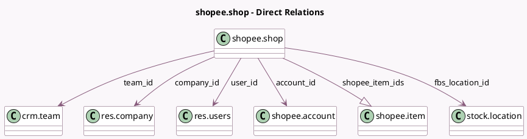

<!-- GENERATED:MODEL -->
---
tags: [odoo, enterprise, generated, model]
---

# shopee.shop

- Module: [[docs/Enterprise Addons/sale_shopee/sale_shopee|sale_shopee]]
- Scope: Enterprise Addons
- Defined in module: yes
- Source files: `models/shopee_shop.py`
- Python classes: `ShopeeShop`
- Description: Shopee Shop

## Field footprint

- Detected fields: 20
- Field types: `Boolean` x 2, `Char` x 3, `Datetime` x 4, `Integer` x 4, `Many2one` x 5, `One2many` x 1, `Selection` x 1
- Relation fields: 6

## Sample fields

- `access_token`: `Char`
- `access_token_expiration_date`: `Datetime`
- `account_id`: `Many2one` (comodel `shopee.account`)
- `active`: `Boolean`
- `authorization_expiration_date`: `Datetime`
- `authorization_remaining_days`: `Integer` (compute `_compute_authorization_remaining_days`)
- `company_id`: `Many2one` (comodel `res.company`)
- `fbs_location_id`: `Many2one` (comodel `stock.location`)
- `last_orders_sync_date`: `Datetime`
- `last_shop_status_sync_date`: `Datetime`
- `name`: `Char`
- `order_count`: `Integer` (compute `_compute_order_count`)
- `refresh_token`: `Char`
- `shop_identifier`: `Integer`
- `shopee_item_count`: `Integer` (compute `_compute_shopee_item_count`)
- `shopee_item_ids`: `One2many` (comodel `shopee.item`)
- `status`: `Selection`
- `synchronize_inventory`: `Boolean`
- `team_id`: `Many2one` (comodel `crm.team`)
- `user_id`: `Many2one` (comodel `res.users`)

## Method hints

- Detected methods: 32
- Action methods: `action_archive`, `action_force_update_shop`, `action_sync_inventory`, `action_sync_orders`, `action_sync_pickings`, `action_view_orders`, `action_view_shopee_items`
- Compute methods: `_compute_authorization_remaining_days`, `_compute_order_count`, `_compute_shopee_item_count`
- Onchange methods: none

## Direct relation diagram

## Navigation

- **Parent:** [[docs/Enterprise Addons/sale_shopee/Models]]

<!-- GENERATED:MODEL -->
