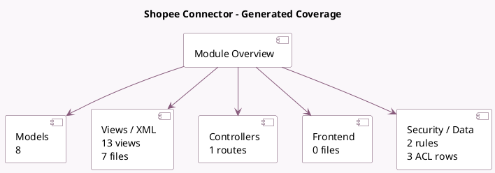

<!-- GENERATED:MODULE -->
---
tags: [odoo, enterprise, module]
---

# Shopee Connector

- Scope: Enterprise Addons
- Source: enterprise/sale_shopee
- Dependencies: [[docs/Community Addons/sale_management/sale_management|sale_management]], [[docs/Community Addons/stock_delivery/stock_delivery|stock_delivery]]

## Summary

Import Shopee orders and sync deliveries

## Generated coverage

- Models: 8
- XML files with UI/data artifacts: 7
- Views: 13
- Actions: 6
- Menus: 3
- Rules (ir.rule): 2
- Access CSV entries: 3
- Controller units: 1
- Frontend asset files: 0

## Module map

## Detail notes

- Models: [[docs/Enterprise Addons/sale_shopee/Models|Models]] (8)
- Views and XML: [[docs/Enterprise Addons/sale_shopee/Views|Views]] (7 files)
- Controllers: [[docs/Enterprise Addons/sale_shopee/Controllers|Controllers]] (1)

## Key models

- `product.product`
- `res.partner`
- `sale.order`
- `shopee.account`
- `shopee.item`
- `shopee.shop`
- `stock.move`
- `stock.picking`

## Navigation

- [[../Enterprise Addons/Enterprise Addons|Back to scope]]
- [[../../docs/docs|Back to docs]]

<!-- GENERATED:MODULE -->

