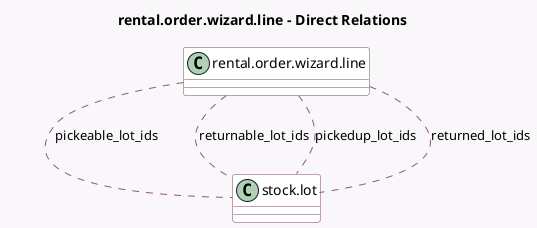

<!-- GENERATED:MODEL -->
---
tags: [odoo, enterprise, generated, model]
---

# rental.order.wizard.line

- Module: [[docs/Enterprise Addons/sale_stock_renting/sale_stock_renting|sale_stock_renting]]
- Scope: Enterprise Addons
- Defined in module: extension only
- Source files: `wizard/rental_processing.py`
- Python classes: `RentalOrderWizardLine`

## Field footprint

- Detected fields: 7
- Field types: `Boolean` x 1, `Float` x 1, `Many2many` x 4, `Selection` x 1
- Relation fields: 4

## Sample fields

- `is_product_storable`: `Boolean` (compute `_compute_is_product_storable`)
- `pickeable_lot_ids`: `Many2many` (comodel `stock.lot`, store `False`)
- `pickedup_lot_ids`: `Many2many` (comodel `stock.lot`)
- `qty_available`: `Float`
- `returnable_lot_ids`: `Many2many` (comodel `stock.lot`, store `False`)
- `returned_lot_ids`: `Many2many` (comodel `stock.lot`)
- `tracking`: `Selection` (related `product_id.tracking`)

## Method hints

- Detected methods: 8
- Action methods: none
- Compute methods: `_compute_is_product_storable`
- Onchange methods: `_onchange_pickedup_lot_ids`, `_onchange_returned_lot_ids`

## Direct relation diagram

## Navigation

- **Parent:** [[docs/Enterprise Addons/sale_stock_renting/Models]]

<!-- GENERATED:MODEL -->
