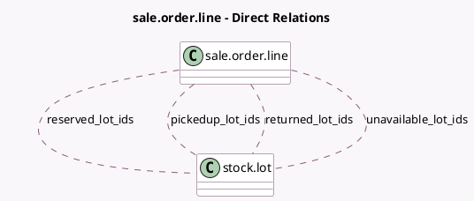

<!-- GENERATED:MODEL -->
---
tags: [odoo, enterprise, generated, model]
---

# sale.order.line

- Module: [[docs/Enterprise Addons/sale_stock_renting/sale_stock_renting|sale_stock_renting]]
- Scope: Enterprise Addons
- Defined in module: extension only
- Source files: `models/sale_order_line.py`
- Python classes: `SaleOrderLine`

## Field footprint

- Detected fields: 6
- Field types: `Boolean` x 1, `Many2many` x 4, `Selection` x 1
- Relation fields: 4

## Sample fields

- `available_reserved_lots`: `Boolean` (compute `_compute_available_reserved_lots`)
- `pickedup_lot_ids`: `Many2many` (comodel `stock.lot`)
- `reserved_lot_ids`: `Many2many` (comodel `stock.lot`)
- `returned_lot_ids`: `Many2many` (comodel `stock.lot`)
- `tracking`: `Selection` (related `product_id.tracking`)
- `unavailable_lot_ids`: `Many2many` (comodel `stock.lot`, compute `_compute_unavailable_lots`, store `False`)

## Method hints

- Detected methods: 22
- Action methods: none
- Compute methods: `_compute_available_reserved_lots`, `_compute_qty_at_date`, `_compute_qty_delivered_method`, `_compute_reservation_begin`, `_compute_unavailable_lots`
- Onchange methods: none

## Direct relation diagram

## Navigation

- **Parent:** [[docs/Enterprise Addons/sale_stock_renting/Models]]

<!-- GENERATED:MODEL -->
