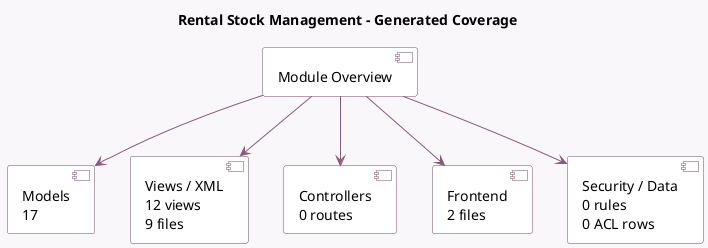

<!-- GENERATED:MODULE -->
---
tags: [odoo, enterprise, module]
---

# Rental Stock Management

- Scope: Enterprise Addons
- Source: enterprise/sale_stock_renting
- Dependencies: [[docs/Enterprise Addons/sale_renting/sale_renting|sale_renting]], [[docs/Community Addons/sale_stock/sale_stock|sale_stock]]

## Summary

Allows use of stock application to manage rentals inventory

## Generated coverage

- Models: 17
- XML files with UI/data artifacts: 9
- Views: 12
- Actions: 2
- Menus: 0
- Rules (ir.rule): 0
- Access CSV entries: 0
- Controller units: 0
- Frontend asset files: 2

## Module map

## Detail notes

- Models: [[docs/Enterprise Addons/sale_stock_renting/Models|Models]] (17)
- Views and XML: [[docs/Enterprise Addons/sale_stock_renting/Views|Views]] (9 files)
- Frontend: [[docs/Enterprise Addons/sale_stock_renting/Frontend|Frontend]] (2 files)

## Key models

- `account.move`
- `account.move.line`
- `product.product`
- `product.template`
- `rental.order.wizard`
- `rental.order.wizard.line`
- `res.company`
- `res.config.settings`
- `sale.order`
- `sale.order.line`
- `sale.rental.report`
- `stock.lot`

## Navigation

- [[../Enterprise Addons/Enterprise Addons|Back to scope]]
- [[../../docs/docs|Back to docs]]

<!-- GENERATED:MODULE -->

