<!-- GENERATED:MODEL -->
---
tags: [odoo, enterprise, generated, model]
---

# product.template

- Module: [[docs/Enterprise Addons/sale_subscription/sale_subscription|sale_subscription]]
- Scope: Enterprise Addons
- Defined in module: extension only
- Source files: `models/product_template.py`
- Python classes: `ProductTemplate`

## Field footprint

- Detected fields: 6
- Field types: `Boolean` x 3, `Char` x 1, `One2many` x 2
- Relation fields: 2

## Sample fields

- `allow_one_time_sale`: `Boolean`
- `allow_prorated_price`: `Boolean` (compute `_compute_allow_prorated_price`, store `True`)
- `display_subscription_pricing`: `Char` (compute `_compute_display_subscription_pricing`)
- `recurring_invoice`: `Boolean`
- `subscription_rule_ids`: `One2many` (comodel `product.pricelist.item`)
- `subscription_rule_ids_fixed`: `One2many` (comodel `product.pricelist.item`)

## Method hints

- Detected methods: 13
- Action methods: none
- Compute methods: `_compute_allow_prorated_price`, `_compute_display_subscription_pricing`
- Onchange methods: `_onchange_recurring_invoice`

## Direct relation diagram

```plantuml
@startuml
!define ODOO_COLOR_PRIMARY #714B67
!define ODOO_COLOR_ACCENT #875A7B
!define ODOO_COLOR_BG #FAF7FA

skinparam backgroundColor ODOO_COLOR_BG
skinparam defaultTextAlignment left
skinparam ArrowColor ODOO_COLOR_ACCENT
skinparam ClassBackgroundColor white
skinparam ClassBorderColor ODOO_COLOR_PRIMARY
skinparam ComponentBackgroundColor white
skinparam ComponentBorderColor ODOO_COLOR_PRIMARY
skinparam NoteBackgroundColor #FFF8FF
skinparam NoteBorderColor ODOO_COLOR_ACCENT
skinparam SequenceLifeLineBorderColor ODOO_COLOR_ACCENT
skinparam SequenceLifeLineBackgroundColor #FFFFFF
skinparam SequenceParticipantBorderColor ODOO_COLOR_PRIMARY
skinparam SequenceParticipantBackgroundColor #FFFFFF
skinparam sequence {
  ArrowColor ODOO_COLOR_ACCENT
  ActorBorderColor ODOO_COLOR_PRIMARY
}
title product.template - Direct Relations
class "product.template" as product_template
class "product.pricelist.item" as product_pricelist_item
product_template --|> product_pricelist_item : subscription_rule_ids
product_template --|> product_pricelist_item : subscription_rule_ids_fixed
@enduml
```

## Navigation

- **Parent:** [[docs/Enterprise Addons/sale_subscription/Models]]

<!-- GENERATED:MODEL -->
