<!-- GENERATED:MODEL -->
---
tags: [odoo, enterprise, generated, model]
---

# sale.order.line

- Module: [[docs/Enterprise Addons/sale_subscription/sale_subscription|sale_subscription]]
- Scope: Enterprise Addons
- Defined in module: extension only
- Source files: `models/sale_order_line.py`
- Python classes: `SaleOrderLine`

## Field footprint

- Detected fields: 11
- Field types: `Boolean` x 1, `Date` x 4, `Many2many` x 1, `Many2one` x 3, `Monetary` x 1, `Selection` x 1
- Relation fields: 4

## Sample fields

- `display_type`: `Selection`
- `last_invoiced_date`: `Date` (compute `_compute_last_invoiced_date`, store `True`)
- `next_invoice_date`: `Date` (related `order_id.next_invoice_date`)
- `parent_line_id`: `Many2one` (comodel `sale.order.line`, compute `_compute_parent_line_id`, store `True`)
- `pricelist_id`: `Many2one` (related `order_id.pricelist_id`)
- `product_template_variant_value_ids`: `Many2many` (related `product_id.product_template_variant_value_ids`)
- `recurring_invoice`: `Boolean` (related `product_template_id.recurring_invoice`)
- `recurring_monthly`: `Monetary` (compute `_compute_recurring_monthly`)
- `subscription_end_date`: `Date` (related `order_id.end_date`)
- `subscription_plan_id`: `Many2one` (related `order_id.plan_id`)
- `subscription_start_date`: `Date` (related `order_id.start_date`)

## Method hints

- Detected methods: 34
- Action methods: none
- Compute methods: `_compute_amount_to_invoice`, `_compute_discount`, `_compute_invoice_status`, `_compute_last_invoiced_date`, `_compute_parent_line_id`, `_compute_price_unit`, `_compute_pricelist_item_id`, `_compute_qty_invoiced`, and 2 more
- Onchange methods: none

## Direct relation diagram

```plantuml
@startuml
!define ODOO_COLOR_PRIMARY #714B67
!define ODOO_COLOR_ACCENT #875A7B
!define ODOO_COLOR_BG #FAF7FA

skinparam backgroundColor ODOO_COLOR_BG
skinparam defaultTextAlignment left
skinparam ArrowColor ODOO_COLOR_ACCENT
skinparam ClassBackgroundColor white
skinparam ClassBorderColor ODOO_COLOR_PRIMARY
skinparam ComponentBackgroundColor white
skinparam ComponentBorderColor ODOO_COLOR_PRIMARY
skinparam NoteBackgroundColor #FFF8FF
skinparam NoteBorderColor ODOO_COLOR_ACCENT
skinparam SequenceLifeLineBorderColor ODOO_COLOR_ACCENT
skinparam SequenceLifeLineBackgroundColor #FFFFFF
skinparam SequenceParticipantBorderColor ODOO_COLOR_PRIMARY
skinparam SequenceParticipantBackgroundColor #FFFFFF
skinparam sequence {
  ArrowColor ODOO_COLOR_ACCENT
  ActorBorderColor ODOO_COLOR_PRIMARY
}
title sale.order.line - Direct Relations
class "sale.order.line" as sale_order_line
class "sale.order.line" as sale_order_line
sale_order_line --> sale_order_line : parent_line_id
@enduml
```

## Navigation

- **Parent:** [[docs/Enterprise Addons/sale_subscription/Models]]

<!-- GENERATED:MODEL -->
