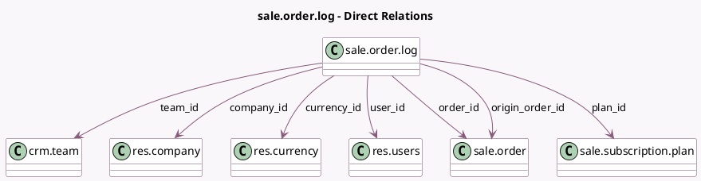

<!-- GENERATED:MODEL -->
---
tags: [odoo, enterprise, generated, model]
---

# sale.order.log

- Module: [[docs/Enterprise Addons/sale_subscription/sale_subscription|sale_subscription]]
- Scope: Enterprise Addons
- Defined in module: yes
- Source files: `models/sale_order_log.py`
- Python classes: `SaleOrderLog`
- Description: Sale Order Log

## Field footprint

- Detected fields: 13
- Field types: `Date` x 2, `Many2one` x 7, `Monetary` x 2, `Selection` x 2
- Relation fields: 7

## Sample fields

- `amount_signed`: `Monetary`
- `company_id`: `Many2one` (comodel `res.company`, related `order_id.company_id`, store `True`)
- `currency_id`: `Many2one` (comodel `res.currency`, related `order_id.currency_id`, store `True`)
- `effective_date`: `Date`
- `event_date`: `Date`
- `event_type`: `Selection`
- `order_id`: `Many2one` (comodel `sale.order`)
- `origin_order_id`: `Many2one` (comodel `sale.order`, compute `_compute_origin_order_id`, store `True`)
- `plan_id`: `Many2one` (comodel `sale.subscription.plan`, related `order_id.plan_id`, store `True`)
- `recurring_monthly`: `Monetary`
- `subscription_state`: `Selection`
- `team_id`: `Many2one` (comodel `crm.team`, related `order_id.team_id`, store `True`)
- `user_id`: `Many2one` (comodel `res.users`, related `order_id.user_id`, store `True`)

## Method hints

- Detected methods: 13
- Action methods: none
- Compute methods: `_compute_display_name`, `_compute_origin_order_id`
- Onchange methods: none

## Direct relation diagram

## Navigation

- **Parent:** [[docs/Enterprise Addons/sale_subscription/Models]]

<!-- GENERATED:MODEL -->
