<!-- GENERATED:MODEL -->
---
tags: [odoo, enterprise, generated, model]
---

# sale.order.log.report

- Module: [[docs/Enterprise Addons/sale_subscription/sale_subscription|sale_subscription]]
- Scope: Enterprise Addons
- Defined in module: yes
- Source files: `report/sale_order_log_report.py`
- Python classes: `SaleOrderLogReport`
- Description: Sales Log Analysis Report

## Field footprint

- Detected fields: 30
- Field types: `Char` x 1, `Date` x 4, `Integer` x 1, `Many2one` x 16, `Monetary` x 5, `Selection` x 3
- Relation fields: 16

## Sample fields

- `amount_signed`: `Monetary` (comodel `MRR Change`)
- `arr_change_normalized`: `Monetary` (comodel `ARR Change (normalized)`)
- `campaign_id`: `Many2one` (comodel `utm.campaign`)
- `client_order_ref`: `Char`
- `close_reason_id`: `Many2one` (comodel `sale.order.close.reason`)
- `commercial_partner_id`: `Many2one` (comodel `res.partner`)
- `company_id`: `Many2one` (comodel `res.company`)
- `contract_number`: `Integer` (comodel `Active Subscriptions Change`)
- `country_id`: `Many2one` (comodel `res.country`)
- `currency_id`: `Many2one` (comodel `res.currency`)
- `effective_date`: `Date`
- `end_date`: `Date`
- `event_date`: `Date`
- `event_type`: `Selection`
- `first_contract_date`: `Date` (comodel `First Contract Date`)
- `industry_id`: `Many2one` (comodel `res.partner.industry`)
- `log_currency_id`: `Many2one` (comodel `res.currency`)
- `mrr_change_normalized`: `Monetary` (comodel `MRR Change (normalized)`)
- `order_id`: `Many2one` (comodel `sale.order`)
- `origin_order_id`: `Many2one` (comodel `sale.order`)

## Method hints

- Detected methods: 8
- Action methods: `action_open_sale_order`
- Compute methods: none
- Onchange methods: none

## Direct relation diagram

```plantuml
@startuml
!define ODOO_COLOR_PRIMARY #714B67
!define ODOO_COLOR_ACCENT #875A7B
!define ODOO_COLOR_BG #FAF7FA

skinparam backgroundColor ODOO_COLOR_BG
skinparam defaultTextAlignment left
skinparam ArrowColor ODOO_COLOR_ACCENT
skinparam ClassBackgroundColor white
skinparam ClassBorderColor ODOO_COLOR_PRIMARY
skinparam ComponentBackgroundColor white
skinparam ComponentBorderColor ODOO_COLOR_PRIMARY
skinparam NoteBackgroundColor #FFF8FF
skinparam NoteBorderColor ODOO_COLOR_ACCENT
skinparam SequenceLifeLineBorderColor ODOO_COLOR_ACCENT
skinparam SequenceLifeLineBackgroundColor #FFFFFF
skinparam SequenceParticipantBorderColor ODOO_COLOR_PRIMARY
skinparam SequenceParticipantBackgroundColor #FFFFFF
skinparam sequence {
  ArrowColor ODOO_COLOR_ACCENT
  ActorBorderColor ODOO_COLOR_PRIMARY
}
title sale.order.log.report - Direct Relations
class "sale.order.log.report" as sale_order_log_report
class "crm.team" as crm_team
class "product.pricelist" as product_pricelist
class "res.company" as res_company
class "res.country" as res_country
class "res.currency" as res_currency
class "res.partner" as res_partner
class "res.partner.industry" as res_partner_industry
class "res.users" as res_users
class "sale.order" as sale_order
class "sale.order.close.reason" as sale_order_close_reason
class "sale.order.template" as sale_order_template
class "sale.subscription.plan" as sale_subscription_plan
sale_order_log_report --> res_partner : partner_id
sale_order_log_report --> res_company : company_id
sale_order_log_report --> res_users : user_id
sale_order_log_report --> crm_team : team_id
sale_order_log_report --> product_pricelist : pricelist_id
sale_order_log_report --> sale_order_template : template_id
sale_order_log_report --> sale_subscription_plan : plan_id
sale_order_log_report --> res_country : country_id
sale_order_log_report --> res_partner_industry : industry_id
sale_order_log_report --> res_partner : commercial_partner_id
sale_order_log_report --> utm_campaign : campaign_id
sale_order_log_report --> sale_order : origin_order_id
sale_order_log_report --> sale_order : order_id
sale_order_log_report --> sale_order_close_reason : close_reason_id
sale_order_log_report --> res_currency : currency_id
sale_order_log_report --> res_currency : log_currency_id
@enduml
```

## Navigation

- **Parent:** [[docs/Enterprise Addons/sale_subscription/Models]]

<!-- GENERATED:MODEL -->
