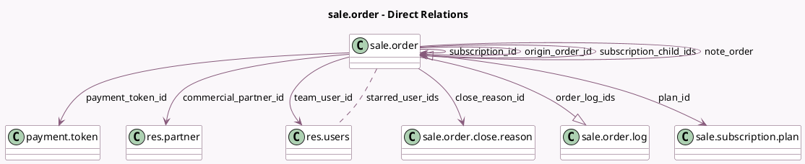

<!-- GENERATED:MODEL -->
---
tags: [odoo, enterprise, generated, model]
---

# sale.order

- Module: [[docs/Enterprise Addons/sale_subscription/sale_subscription|sale_subscription]]
- Scope: Enterprise Addons
- Defined in module: yes
- Source files: `models/sale_order.py`
- Python classes: `SaleOrder`
- Inherits: `rating.mixin`

## Field footprint

- Detected fields: 50
- Field types: `Boolean` x 15, `Date` x 7, `Float` x 4, `Html` x 3, `Integer` x 4, `Many2many` x 1, `Many2one` x 10, `Monetary` x 3, `One2many` x 2, `Selection` x 1
- Relation fields: 13

## Sample fields

- `close_reason_id`: `Many2one` (comodel `sale.order.close.reason`)
- `commercial_partner_id`: `Many2one` (comodel `res.partner`, related `partner_id.commercial_partner_id`)
- `currency_id`: `Many2one`
- `display_late`: `Boolean` (compute `_compute_display_late`)
- `end_date`: `Date`
- `first_contract_date`: `Date` (compute `_compute_first_contract_date`, store `True`)
- `has_recurring_line`: `Boolean` (compute `_compute_has_recurring_line`)
- `history_count`: `Integer` (compute `_compute_history_count`)
- `internal_note`: `Html`
- `internal_note_display`: `Html` (compute `_compute_internal_note_display`)
- `is_batch`: `Boolean`
- `is_closing`: `Boolean` (compute `_compute_is_closing`, store `True`)
- `is_invoice_cron`: `Boolean`
- `is_renewing`: `Boolean` (compute `_compute_is_renewing`)
- `is_subscription`: `Boolean` (comodel `Recurring`, compute `_compute_is_subscription`, store `True`)
- `is_upselling`: `Boolean` (compute `_compute_is_upselling`)
- `kpi_1month_mrr_delta`: `Float` (comodel `KPI 1 Month MRR Delta`)
- `kpi_1month_mrr_percentage`: `Float` (comodel `KPI 1 Month MRR Percentage`)
- `kpi_3months_mrr_delta`: `Float` (comodel `KPI 3 months MRR Delta`)
- `kpi_3months_mrr_percentage`: `Float` (comodel `KPI 3 Months MRR Percentage`)

## Method hints

- Detected methods: 142
- Action methods: `action_confirm`, `action_draft`, `action_preview_sale_order`, `action_quotation_send`, `action_sale_order_log`, `action_update_prices`
- Compute methods: `_compute_access_url`, `_compute_display_late`, `_compute_first_contract_date`, `_compute_has_recurring_line`, `_compute_history_count`, `_compute_internal_note_display`, `_compute_is_closing`, `_compute_is_renewing`, and 21 more
- Onchange methods: none

## Direct relation diagram

## Navigation

- **Parent:** [[docs/Enterprise Addons/sale_subscription/Models]]

<!-- GENERATED:MODEL -->
