<!-- GENERATED:MODEL -->
---
tags: [odoo, enterprise, generated, model]
---

# sale.subscription.change.customer.wizard

- Module: [[docs/Enterprise Addons/sale_subscription/sale_subscription|sale_subscription]]
- Scope: Enterprise Addons
- Defined in module: yes
- Source files: `wizard/sale_subscription_change_customer_wizard.py`
- Python classes: `SaleSubscriptionChangeCustomerWizard`
- Description: Subscription Change Customer Wizard

## Field footprint

- Detected fields: 3
- Field types: `Many2one` x 3
- Relation fields: 3

## Sample fields

- `partner_id`: `Many2one` (comodel `res.partner`)
- `partner_invoice_id`: `Many2one` (comodel `res.partner`)
- `partner_shipping_id`: `Many2one` (comodel `res.partner`)

## Method hints

- Detected methods: 2
- Action methods: none
- Compute methods: none
- Onchange methods: `_onchange_partner_id`

## Direct relation diagram

```plantuml
@startuml
!define ODOO_COLOR_PRIMARY #714B67
!define ODOO_COLOR_ACCENT #875A7B
!define ODOO_COLOR_BG #FAF7FA

skinparam backgroundColor ODOO_COLOR_BG
skinparam defaultTextAlignment left
skinparam ArrowColor ODOO_COLOR_ACCENT
skinparam ClassBackgroundColor white
skinparam ClassBorderColor ODOO_COLOR_PRIMARY
skinparam ComponentBackgroundColor white
skinparam ComponentBorderColor ODOO_COLOR_PRIMARY
skinparam NoteBackgroundColor #FFF8FF
skinparam NoteBorderColor ODOO_COLOR_ACCENT
skinparam SequenceLifeLineBorderColor ODOO_COLOR_ACCENT
skinparam SequenceLifeLineBackgroundColor #FFFFFF
skinparam SequenceParticipantBorderColor ODOO_COLOR_PRIMARY
skinparam SequenceParticipantBackgroundColor #FFFFFF
skinparam sequence {
  ArrowColor ODOO_COLOR_ACCENT
  ActorBorderColor ODOO_COLOR_PRIMARY
}
title sale.subscription.change.customer.wizard - Direct Relations
class "sale.subscription.change.customer.wizard" as sale_subscription_change_customer_wizard
class "res.partner" as res_partner
sale_subscription_change_customer_wizard --> res_partner : partner_id
sale_subscription_change_customer_wizard --> res_partner : partner_invoice_id
sale_subscription_change_customer_wizard --> res_partner : partner_shipping_id
@enduml
```

## Navigation

- **Parent:** [[docs/Enterprise Addons/sale_subscription/Models]]

<!-- GENERATED:MODEL -->
