<!-- GENERATED:MODEL -->
---
tags: [odoo, enterprise, generated, model]
---

# sale.subscription.plan

- Module: [[docs/Enterprise Addons/sale_subscription/sale_subscription|sale_subscription]]
- Scope: Enterprise Addons
- Defined in module: yes
- Source files: `models/sale_subscription_plan.py`
- Python classes: `SaleSubscriptionPlan`
- Description: Subscription Plan

## Field footprint

- Detected fields: 21
- Field types: `Boolean` x 6, `Char` x 4, `Integer` x 5, `Many2many` x 1, `Many2one` x 2, `One2many` x 1, `Selection` x 2
- Relation fields: 4

## Sample fields

- `active`: `Boolean`
- `active_subs_count`: `Integer` (compute `_compute_active_subs_count`)
- `auto_close_limit`: `Integer`
- `auto_close_limit_display`: `Char` (compute `_compute_auto_close_limit_display`)
- `billing_first_day`: `Boolean`
- `billing_period_display`: `Char` (compute `_compute_billing_period_display`)
- `billing_period_display_sentence`: `Char` (compute `_compute_billing_period_display_sentence`)
- `billing_period_unit`: `Selection`
- `billing_period_value`: `Integer`
- `company_id`: `Many2one` (comodel `res.company`)
- `invoice_mail_template_id`: `Many2one` (comodel `mail.template`)
- `name`: `Char`
- `pausable_by_user`: `Boolean`
- `related_plan_id`: `Many2many` (comodel `sale.subscription.plan`)
- `sequence`: `Integer`
- `subscription_line_count`: `Integer` (compute `_compute_active_subscription_line_count`)
- `subscription_rule_ids`: `One2many` (comodel `product.pricelist.item`)
- `user_closable`: `Boolean`
- `user_closable_options`: `Selection`
- `user_extend`: `Boolean` (comodel `Renew`)

## Method hints

- Detected methods: 10
- Action methods: `action_open_active_sub`, `action_open_active_subscription_lines`
- Compute methods: `_compute_active_subs_count`, `_compute_active_subscription_line_count`, `_compute_auto_close_limit_display`, `_compute_billing_period_display`, `_compute_billing_period_display_sentence`
- Onchange methods: none

## Direct relation diagram

```plantuml
@startuml
!define ODOO_COLOR_PRIMARY #714B67
!define ODOO_COLOR_ACCENT #875A7B
!define ODOO_COLOR_BG #FAF7FA

skinparam backgroundColor ODOO_COLOR_BG
skinparam defaultTextAlignment left
skinparam ArrowColor ODOO_COLOR_ACCENT
skinparam ClassBackgroundColor white
skinparam ClassBorderColor ODOO_COLOR_PRIMARY
skinparam ComponentBackgroundColor white
skinparam ComponentBorderColor ODOO_COLOR_PRIMARY
skinparam NoteBackgroundColor #FFF8FF
skinparam NoteBorderColor ODOO_COLOR_ACCENT
skinparam SequenceLifeLineBorderColor ODOO_COLOR_ACCENT
skinparam SequenceLifeLineBackgroundColor #FFFFFF
skinparam SequenceParticipantBorderColor ODOO_COLOR_PRIMARY
skinparam SequenceParticipantBackgroundColor #FFFFFF
skinparam sequence {
  ArrowColor ODOO_COLOR_ACCENT
  ActorBorderColor ODOO_COLOR_PRIMARY
}
title sale.subscription.plan - Direct Relations
class "sale.subscription.plan" as sale_subscription_plan
class "mail.template" as mail_template
class "product.pricelist.item" as product_pricelist_item
class "res.company" as res_company
class "sale.subscription.plan" as sale_subscription_plan
sale_subscription_plan --> res_company : company_id
sale_subscription_plan .. sale_subscription_plan : related_plan_id
sale_subscription_plan --> mail_template : invoice_mail_template_id
sale_subscription_plan --|> product_pricelist_item : subscription_rule_ids
@enduml
```

## Navigation

- **Parent:** [[docs/Enterprise Addons/sale_subscription/Models]]

<!-- GENERATED:MODEL -->
