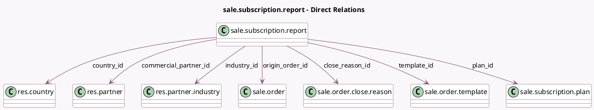

<!-- GENERATED:MODEL -->
---
tags: [odoo, enterprise, generated, model]
---

# sale.subscription.report

- Module: [[docs/Enterprise Addons/sale_subscription/sale_subscription|sale_subscription]]
- Scope: Enterprise Addons
- Defined in module: yes
- Source files: `report/sale_subscription_report.py`
- Python classes: `SaleSubscriptionReport`
- Description: Subscription Analysis
- Inherits: `sale.report`

## Field footprint

- Detected fields: 17
- Field types: `Boolean` x 1, `Char` x 1, `Date` x 3, `Float` x 1, `Many2one` x 7, `Monetary` x 3, `Selection` x 1
- Relation fields: 7

## Sample fields

- `client_order_ref`: `Char`
- `close_reason_id`: `Many2one` (comodel `sale.order.close.reason`)
- `commercial_partner_id`: `Many2one` (comodel `res.partner`)
- `country_id`: `Many2one` (comodel `res.country`)
- `end_date`: `Date` (comodel `End Date`)
- `first_contract_date`: `Date`
- `industry_id`: `Many2one` (comodel `res.partner.industry`)
- `is_subscription`: `Boolean`
- `margin`: `Float`
- `next_invoice_date`: `Date` (comodel `Next Invoice Date`)
- `origin_order_id`: `Many2one` (comodel `sale.order`)
- `plan_id`: `Many2one` (comodel `sale.subscription.plan`)
- `recurring_monthly`: `Monetary` (comodel `Monthly Recurring`)
- `recurring_total`: `Monetary` (comodel `Recurring Revenue`)
- `recurring_yearly`: `Monetary` (comodel `Yearly Recurring`)
- `subscription_state`: `Selection`
- `template_id`: `Many2one` (comodel `sale.order.template`)

## Method hints

- Detected methods: 5
- Action methods: `action_open_subscription_order`
- Compute methods: none
- Onchange methods: none

## Direct relation diagram

## Navigation

- **Parent:** [[docs/Enterprise Addons/sale_subscription/Models]]

<!-- GENERATED:MODEL -->
