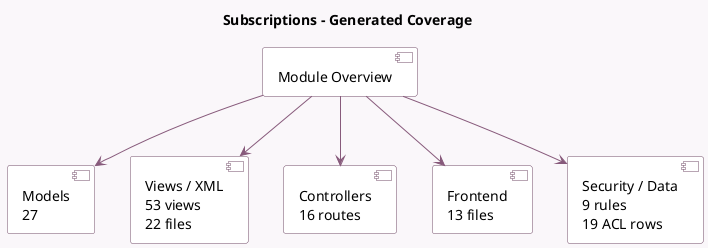

<!-- GENERATED:MODULE -->
---
tags: [odoo, enterprise, module]
---

# Subscriptions

- Scope: Enterprise Addons
- Source: enterprise/sale_subscription
- Dependencies: [[docs/Enterprise Addons/account_accountant/account_accountant|account_accountant]], [[docs/Community Addons/sale_management/sale_management|sale_management]], [[docs/Community Addons/portal/portal|portal]], [[docs/Enterprise Addons/web_cohort/web_cohort|web_cohort]], [[docs/Community Addons/rating/rating|rating]], [[docs/Community Addons/sms/sms|sms]]

## Summary

Generate recurring invoices and manage renewals

## Generated coverage

- Models: 27
- XML files with UI/data artifacts: 22
- Views: 53
- Actions: 45
- Menus: 22
- Rules (ir.rule): 9
- Access CSV entries: 19
- Controller units: 2
- Frontend asset files: 13

## Module map

## Detail notes

- Models: [[docs/Enterprise Addons/sale_subscription/Models|Models]] (27)
- Views and XML: [[docs/Enterprise Addons/sale_subscription/Views|Views]] (22 files)
- Controllers: [[docs/Enterprise Addons/sale_subscription/Controllers|Controllers]] (2)
- Frontend: [[docs/Enterprise Addons/sale_subscription/Frontend|Frontend]] (13 files)

## Key models

- `account.move`
- `account.move.line`
- `account.move.send`
- `ir.http`
- `payment.link.wizard`
- `payment.provider`
- `payment.token`
- `payment.transaction`
- `product.pricelist`
- `product.pricelist.item`
- `product.product`
- `product.template`

## Navigation

- [[../Enterprise Addons/Enterprise Addons|Back to scope]]
- [[../../docs/docs|Back to docs]]

<!-- GENERATED:MODULE -->

