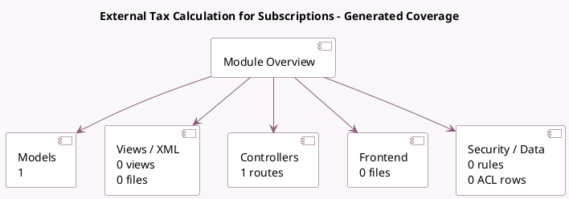

<!-- GENERATED:MODULE -->
---
tags: [odoo, enterprise, module]
---

# External Tax Calculation for Subscriptions

- Scope: Enterprise Addons
- Source: enterprise/sale_subscription_external_tax
- Dependencies: [[docs/Enterprise Addons/sale_external_tax/sale_external_tax|sale_external_tax]], [[docs/Enterprise Addons/sale_subscription/sale_subscription|sale_subscription]]

## Generated coverage

- Models: 1
- XML files with UI/data artifacts: 0
- Views: 0
- Actions: 0
- Menus: 0
- Rules (ir.rule): 0
- Access CSV entries: 0
- Controller units: 1
- Frontend asset files: 0

## Module map

## Detail notes

- Models: [[docs/Enterprise Addons/sale_subscription_external_tax/Models|Models]] (1)
- Controllers: [[docs/Enterprise Addons/sale_subscription_external_tax/Controllers|Controllers]] (1)

## Key models

- `sale.order`

## Navigation

- [[../Enterprise Addons/Enterprise Addons|Back to scope]]
- [[../../docs/docs|Back to docs]]

<!-- GENERATED:MODULE -->

