<!-- GENERATED:MODEL -->
---
tags: [odoo, enterprise, generated, model]
---

# edit.billable.time.target

- Module: [[docs/Enterprise Addons/sale_timesheet_enterprise/sale_timesheet_enterprise|sale_timesheet_enterprise]]
- Scope: Enterprise Addons
- Defined in module: yes
- Source files: `wizard/edit_billable_time_target.py`
- Python classes: `EditBillableTimeTarget`
- Description: Edit Billable Time Target wizard from Timesheet for users without employee access

## Field footprint

- Detected fields: 30
- Field types: `Boolean` x 4, `Char` x 6, `Datetime` x 1, `Float` x 1, `Image` x 4, `Many2one` x 11, `One2many` x 1, `Selection` x 2
- Relation fields: 12

## Sample fields

- `active`: `Boolean`
- `address_id`: `Many2one` (comodel `res.partner`)
- `avatar_128`: `Image` (comodel `Avatar 128`, related `employee_id.avatar_128`)
- `avatar_1920`: `Image` (comodel `Avatar 1920`, related `employee_id.avatar_1920`)
- `billable_time_target`: `Float`
- `birthday_public_display_string`: `Char` (related `employee_id.birthday_public_display_string`)
- `child_ids`: `One2many` (comodel `hr.employee.public`)
- `coach_id`: `Many2one` (comodel `hr.employee.public`)
- `company_id`: `Many2one` (comodel `res.company`)
- `create_date`: `Datetime`
- `department_id`: `Many2one` (comodel `hr.department`)
- `employee_id`: `Many2one` (comodel `hr.employee`)
- `hr_icon_display`: `Selection` (related `employee_id.hr_icon_display`)
- `hr_presence_state`: `Selection` (related `employee_id.hr_presence_state`)
- `image_1024`: `Image` (comodel `Image 1024`, related `employee_id.image_1024`)
- `image_128`: `Image` (comodel `Image 128`, related `employee_id.image_128`)
- `job_id`: `Many2one` (comodel `hr.job`)
- `member_of_department`: `Boolean` (related `employee_id.member_of_department`)
- `mobile_phone`: `Char`
- `name`: `Char`

## Method hints

- Detected methods: 3
- Action methods: none
- Compute methods: none
- Onchange methods: none

## Direct relation diagram

```plantuml
@startuml
!define ODOO_COLOR_PRIMARY #714B67
!define ODOO_COLOR_ACCENT #875A7B
!define ODOO_COLOR_BG #FAF7FA

skinparam backgroundColor ODOO_COLOR_BG
skinparam defaultTextAlignment left
skinparam ArrowColor ODOO_COLOR_ACCENT
skinparam ClassBackgroundColor white
skinparam ClassBorderColor ODOO_COLOR_PRIMARY
skinparam ComponentBackgroundColor white
skinparam ComponentBorderColor ODOO_COLOR_PRIMARY
skinparam NoteBackgroundColor #FFF8FF
skinparam NoteBorderColor ODOO_COLOR_ACCENT
skinparam SequenceLifeLineBorderColor ODOO_COLOR_ACCENT
skinparam SequenceLifeLineBackgroundColor #FFFFFF
skinparam SequenceParticipantBorderColor ODOO_COLOR_PRIMARY
skinparam SequenceParticipantBackgroundColor #FFFFFF
skinparam sequence {
  ArrowColor ODOO_COLOR_ACCENT
  ActorBorderColor ODOO_COLOR_PRIMARY
}
title edit.billable.time.target - Direct Relations
class "edit.billable.time.target" as edit_billable_time_target
class "hr.department" as hr_department
class "hr.employee" as hr_employee
class "hr.employee.public" as hr_employee_public
class "hr.job" as hr_job
class "hr.work.location" as hr_work_location
class "res.company" as res_company
class "res.partner" as res_partner
class "res.users" as res_users
class "resource.calendar" as resource_calendar
edit_billable_time_target --> hr_employee : employee_id
edit_billable_time_target --> resource_calendar : resource_calendar_id
edit_billable_time_target --> res_company : company_id
edit_billable_time_target --> hr_department : department_id
edit_billable_time_target --> hr_job : job_id
edit_billable_time_target --> hr_employee_public : parent_id
edit_billable_time_target --|> hr_employee_public : child_ids
edit_billable_time_target --> res_partner : address_id
edit_billable_time_target --> hr_work_location : work_location_id
edit_billable_time_target --> res_users : timesheet_manager_id
edit_billable_time_target --> res_users : user_id
edit_billable_time_target --> hr_employee_public : coach_id
@enduml
```

## Navigation

- **Parent:** [[docs/Enterprise Addons/sale_timesheet_enterprise/Models]]

<!-- GENERATED:MODEL -->
