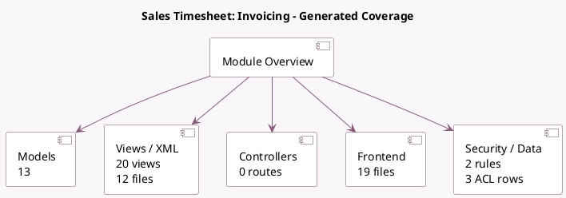

<!-- GENERATED:MODULE -->
---
tags: [odoo, enterprise, module]
---

# Sales Timesheet: Invoicing

- Scope: Enterprise Addons
- Source: enterprise/sale_timesheet_enterprise
- Dependencies: [[docs/Community Addons/sale_timesheet/sale_timesheet|sale_timesheet]], [[docs/Enterprise Addons/timesheet_grid/timesheet_grid|timesheet_grid]]

## Summary

Configure timesheet invoicing

## Generated coverage

- Models: 13
- XML files with UI/data artifacts: 12
- Views: 20
- Actions: 5
- Menus: 5
- Rules (ir.rule): 2
- Access CSV entries: 3
- Controller units: 0
- Frontend asset files: 19

## Module map

## Detail notes

- Models: [[docs/Enterprise Addons/sale_timesheet_enterprise/Models|Models]] (13)
- Views and XML: [[docs/Enterprise Addons/sale_timesheet_enterprise/Views|Views]] (12 files)
- Frontend: [[docs/Enterprise Addons/sale_timesheet_enterprise/Frontend|Frontend]] (19 files)

## Key models

- `account.analytic.line`
- `account.move.line`
- `edit.billable.time.target`
- `hr.employee`
- `hr.employee.public`
- `hr.timesheet.tip`
- `ir.ui.menu`
- `project.project`
- `project.task`
- `res.company`
- `res.config.settings`
- `sale.advance.payment.inv`

## Navigation

- [[../Enterprise Addons/Enterprise Addons|Back to scope]]
- [[../../docs/docs|Back to docs]]

<!-- GENERATED:MODULE -->

